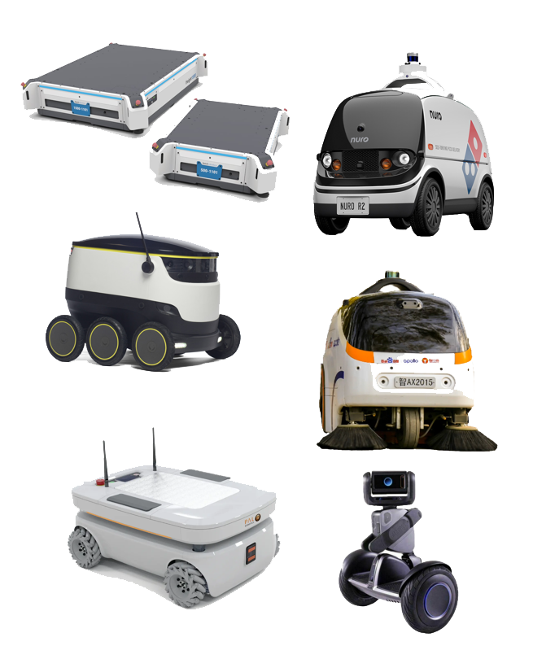
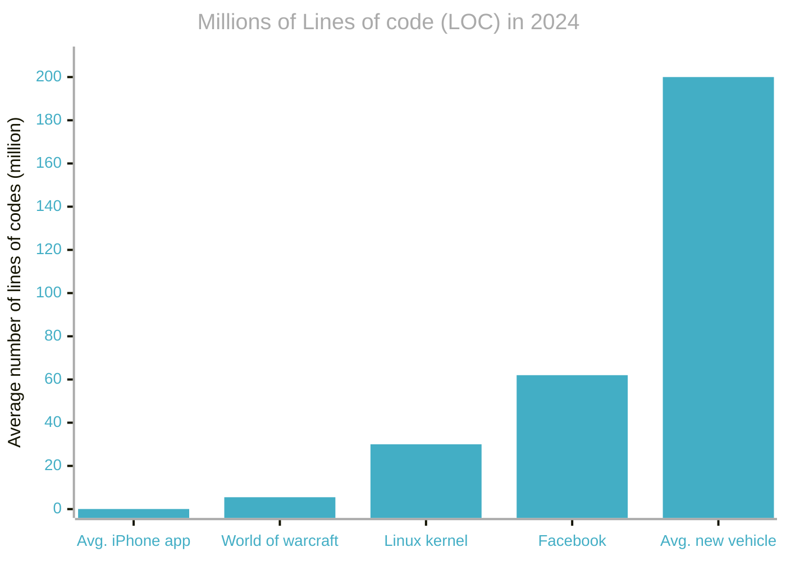
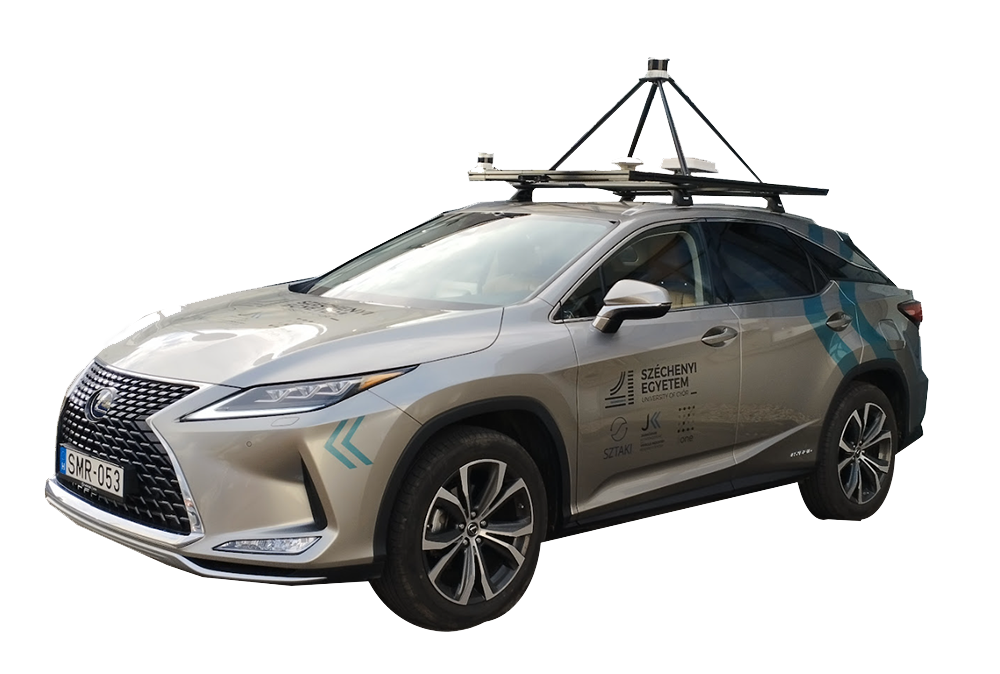
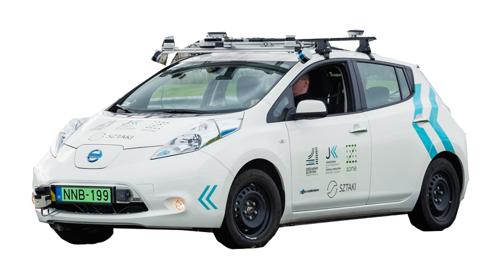
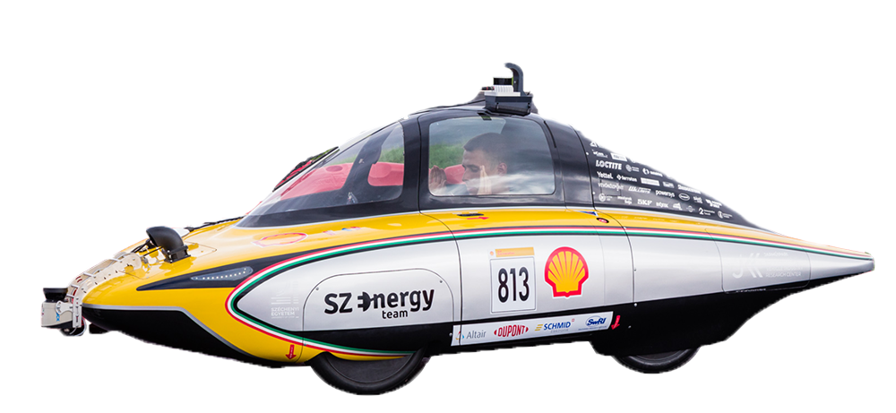
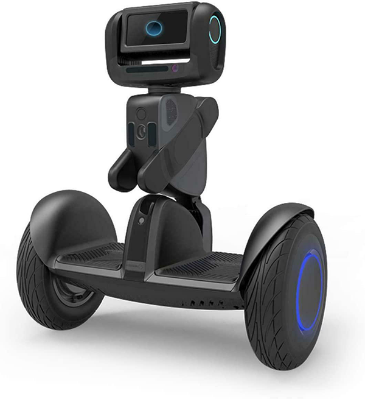
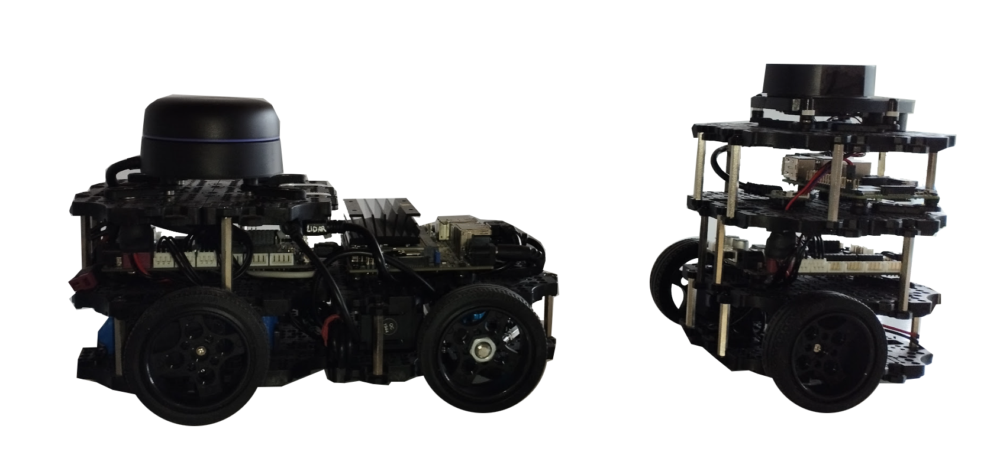
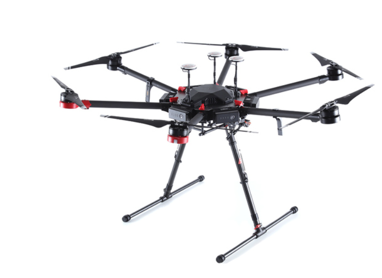

# Bevezetés

Rendszerszinten az önvezetés a következő alfunkciók összegeként írható le:


[](https://raw.githubusercontent.com/sze-info/arj/main/docs/_images/overview02.svg)
Irodalom: [[TU München](https://github.com/TUMFTM/Lecture_ADSE)], [[Autoware](https://github.com/autowarefoundation/autoware)], [[University of Texas at Dallas](https://nova-utd.github.io/navigator/system-overview.html)], [[ApolloAuto](https://github.com/ApolloAuto/apollo/blob/master/docs/02_Quick%20Start/demo_guide/images/Apollo_3_5_software_architecture.png)]

1. **Érzékelés**: egyszerű driver-program szintű nyers adatok előállításával foglakozik, például egy kamera szenzorból a kép előállítása a rendszer számára.
2. **Észlelés**: ez már összetettebb folyamat, a bemeneti adatokból kinyerni a rendszer számára fontos információkat, például gyalogos felismerése kamerakép alapján.
3. **Tervezés**: a jármű útját, vagy trajektóriáját tervezi meg globális szinten (a szenzorok érzékelési tartományán túl), illetve lokális szinten (a szenzorok érzékelés tartományán belül).
4. **Szabályozás**: a tervező által előállított útvonal, vagy tarjektória lekövetése, például Pure-Pursuit szabályzó, Modell Prediktív Szabályzó (Model Predictive Control, MPC) stb. segítségével.
5. **Aktuálás**: a rendszer által előállított referenciajelek (kormányszög, gáz és fékpedál) kiadása (pl. [CAN bus](https://en.wikipedia.org/wiki/CAN_bus) rendszeren).

A fenti beosztás megfigyelhető nagyobb rendszerek, például az [Autoware összefoglaló rendszerábráján is](https://app.diagrams.net/?lightbox=1#Uhttps://autowarefoundation.github.io/autoware-documentation/main/design/autoware-architecture/node-diagram/overall-node-diagram-autoware-universe.drawio.svg). Robotikában ismeretes még a sense-think-act paradigma is. Itt a gondolkodás (think) foglalja össze az észlelést, a tervezést és valamennyire a szabályozást is.

```slides
title: NN Presentation
url_stub: overview1
nav:
  - slides/intro/01_overview.md
  - slides/intro/02_overview.md
  - slides/intro/03_overview.md
  - slides/intro/04_overview.md
  - slides/intro/05_overview.md
```

Nézzünk minden részfeladatra egy szemléltetést, az egyetemünk egyik önvezető funkciókkal rendelkező autóján, a zalaegerszegi tesztpályán:

<iframe 
  width="560" height="315"
  src="https://www.youtube.com/embed/dlljhM7CWtI?autoplay=0&loop=1&playlist=dlljhM7CWtI&mute=1" 
  frameborder="0" 
  allow="autoplay; encrypted-media" 
  allowfullscreen>
</iframe>

<iframe width="560" height="315" src="https://www.youtube.com/embed/9eFqsei1J70?rel=0" title="YouTube video player" frameborder="0" allow="accelerometer; autoplay; clipboard-write; encrypted-media; gyroscope; picture-in-picture; web-share" allowfullscreen></iframe>


# Önvezetés vs. vezetéstámogatás
## SAE szintek

A SAE J3016 szabvány definiálja a sofőr és a jármű rendszere közötti munkamegosztást.

- **0. szint**: L0 - No Driving Automation, azaz a vezetésautomatizáció teljes hiánya.
- **1. szint**: L1 - Driver Assistance, itt bizonyos vezetéstámogató funkciók már beleszólhatnak a jármű mozgásába.
- **2. szint**: L2 - Partial Driving Automation, azaz mindkét irányba történő manővert végez az autó, a felügyelet az emberé.
- **3. szint**: L3 - Conditional Driving Automation, itt ha a jármű kéri, a sofőrnek vissza kell vennie az irányítást.
- **4. szint**: L4 - High Driving Automation, itt már minden felelősség a járművé, de hagyományos üzemmódban is használható még.
- **5. szint**: L5 - Full Driving Automation, Autonomous, itt is a járműé a feleősség, sőt, nem is lehet hagyományos kormánnyal használni.

A szabvány azonban nem íjra le, hogy milyen "scope" / terület a jármű korlátja. Például egy önvezető reptéri busz nem léphet ki a reptér területéről. Ugyanígy a Waymo, Cruise vagy a Zoox robotaxija jellemzően kisebb régióban, magyar hasonlatként nagyjából 1-2 vármegyényi területen működik csak. Ezt nevezzük "geofencing"-nek is.

## Példák

Ahogy láthattuk, önvezető (autonomous) járművekhez (L5) hasonló technológiák találhatók a vezetéstámogató (automated) szinteken (L2/L3) is. Azonban a feladat komplexitásban teljesen más szintet jelent.


| Szint: | L2/L3 | L5 |
|---:|:---:|:---:|
| Elnevezés: | Automatizált, vezetéstámogató | Autonóm, önvezető |
| Jellemző szenzorok:| Kamera, radar | Kamera, radar, LIDAR, GPS |
| Példák: | Tesla, Audi, BMW | Waymo, Zoox, Cruise |


# Önvezető járművek és robotok

| Robotok | Robotaxik |
|---|---|
|  |  |
| Nuro, Segway, Turtlebot, Clearpath, Starship  | Zoox, Cruise, Waymo, Navya, Sensible4 |

Nézzünk egy példát, ami a Zoox önvezető robotaxit mutaja be működés közben:

<iframe width="560" height="315" src="https://www.youtube.com/embed/2sGf_3cAwjA?rel=0" title="YouTube video player" frameborder="0" allow="accelerometer; autoplay; clipboard-write; encrypted-media; gyroscope; picture-in-picture; web-share" allowfullscreen></iframe>

Nézzük meg, hogyan akadályoz meg a Google Waymo önvezető robotaxija különböző baleseteket:

<iframe width="560" height="315" src="https://www.youtube.com/embed/nAuna_qzf6k?si=km2nSToaOVL3MU7r" title="YouTube video player" frameborder="0" allow="accelerometer; autoplay; clipboard-write; encrypted-media; gyroscope; picture-in-picture; web-share" referrerpolicy="strict-origin-when-cross-origin" allowfullscreen></iframe>

Önvezető autó érzékelése a győri campuson:
<iframe 
  width="560" height="315" 
  src="https://www.youtube.com/embed/FmAkOa9vDyY?autoplay=0&loop=1&playlist=FmAkOa9vDyY&mute=1" 
  frameborder="0" 
  allow="autoplay; encrypted-media" 
  allowfullscreen>
</iframe>

Bővebben: [waymo.com/blog/2025/05/waymo-making-streets-safer-for-vru](https://waymo.com/blog/2025/05/waymo-making-streets-safer-for-vru)

# Kódsorok

Az alábbi ábrából látszik, hogy egy mai átlagos (vezetéstámogatással rendelkező) személyautó igen komplex szoftvermérnöki munka eredménye, azonban az is világos, hogy a jövőben az önvezető járművek még ennél is összetettebb megoldásokat fognak igényelni.


Forrás: [statista](https://www.statista.com/statistics/1370978/automotive-software-average-lines-of-codes-per-vehicle-globally/#:~:text=Between%202015%20and%202020%2C%20the,production%20in%20the%20following%20years.), [informationisbeautiful](https://informationisbeautiful.net/visualizations/million-lines-of-code/)


# Egyetemi járművek

A Széchenyi István Egyetem szerencsére relatív sok átalakított személygépjárművel, illetve robottal rendelkezik. Ezek a következőek:

## Lexus RX450h MY2016+ (autó)
Szenzorai: Ouster OS2-64 LIDAR, 2x OS1-32 LIDAR, Stereolabs Zed2i mélységkamera.
További információ [itt](https://github.com/szenergy/szenergy-public-resources/wiki/H-sensorset2021.L).

<figure markdown="span">
  { width="80%" }
  <figcaption>Lexus</figcaption>
</figure>

## Nissan Leaf (autó)
Szenzorai: 2x Ouster OS1-64 LIDAR, 2x Velodyne VLP16 LIDAR, SICK LMS111 LIDAR, Stereolabs Zed / Zed2 mélységkamera.
További információ [itt](https://github.com/szenergy/szenergy-public-resources/wiki/H-sensorset2020.A).

<figure markdown="span">
  { width="80%" }
  <figcaption>Nissan Leaf</figcaption>
</figure>

## Szenergy (autó)
Szenzorai: Ouster OS1-128 LIDAR, SICK LMS111 LIDAR, Stereolabs Zed2i mélységkamera.
További információ [itt](https://www.youtube.com/szenergyteam).

<figure markdown="span">
  { width="80%" }
  <figcaption>Szenergy</figcaption>
</figure>

A Szenergy csapata európa legnagyobb önvezető versenyén, a Shell Eco-marathon Autonomous Urban Concept (AUC) versenyen 2023-ban első, előtte pedig második helyezést ért el. A doboogós helyezések ezekben az évek ben így alakultak:


| 🏆 | 2022 | 2023 | 2024 |
|:---:|---|---|---|
| 1. | DTU Road Runners, Technical University of Denmark (`Denmark`)  | SZEnergy Team, Széchenyi István University (`Hungary`) | SZEnergy Team, Széchenyi István University (`Hungary`) |
| 2. | SZEnergy Team, Széchenyi István University (`Hungary`)  | Team EVA,  Hogeschool Van Amsterdam University (`Netherlands`) | H2politO,Molecole Urbane Politecnico Di Torino University (`Italy`) |
| 3. | DNV Fuel Fighter, Norwegian University of Science And Technology (`Norway`) | H2politO,Molecole Urbane Politecnico Di Torino University (`Italy`) | Team EVA,  Hogeschool Van Amsterdam University (`Netherlands`) |

Forrás: [shellecomarathon.com](https://www.shellecomarathon.com/about/previous-seasons.html)

<iframe width="560" height="315" src="https://www.youtube.com/embed/8yfCvTJF5I0?si=HkQV_ftpOQNymNPG&amp;start=50" title="YouTube video player" frameborder="0" allow="accelerometer; autoplay; clipboard-write; encrypted-media; gyroscope; picture-in-picture; web-share" referrerpolicy="strict-origin-when-cross-origin" allowfullscreen></iframe>

## F1/10 (Ackermann robot) / Roboworks Rosbot mini Ackermann

Az F1/10 verseny egy autonóm járművekkel kapcsolatos verseny, ahol a résztvevők 1/10-es méretarányú Formula 1-es autómodelleket építenek és programoznak, hogy azok önállóan navigáljanak egy versenypályán. A cél az, hogy a járművek a lehető leggyorsabban és legbiztonságosabban teljesítsék a pályát, miközben elkerülik az akadályokat és a többi autót. A verseny során a résztvevők tesztelhetik robotikai, mesterséges intelligencia és gépi tanulási ismereteiket. A Roboworks robotja az F1/10 jármű méreéhez és szenzorozottságához nagyon hasonló. F1tenth jármű [leírás itt](https://f1tenth.org/build.html).

<figure markdown="span">
  { width="80%" }
</figure>

<figure markdown="span">
  { width="80%" }
</figure>


<iframe width="560" height="315" src="https://www.youtube.com/embed/k1tdeXjaJpk?si=_N7tOW_OVQDV6fZY" title="YouTube video player" frameborder="0" allow="accelerometer; autoplay; clipboard-write; encrypted-media; gyroscope; picture-in-picture; web-share" referrerpolicy="strict-origin-when-cross-origin" allowfullscreen></iframe>

## Traffic Cone Manipulation Robot
Szenzorok: Intel RealSense RGB-D camera, IMU, GPS(GNSS)

<figure markdown="span">
  { width="60%" }
  <figcaption>Traffic Cone Manipulation Robot</figcaption>
</figure>

## Segway Loomo (robot)
Leírás [itt](https://github.com/jkk-research/loomo_base).

<figure markdown="span">
  { width="40%" }
  <!-- <figcaption></figcaption> -->
</figure>


## Husarion ROSbot 2 Pro (robot)
Leírás [itt](https://husarion.com/manuals/rosbot/).

<figure markdown="span">
  { width="40%" }
  <!-- <figcaption></figcaption> -->
</figure>


## Robotis ROS TurtleBot 3 (robot)
Leírás [itt](https://emanual.robotis.com/docs/en/platform/turtlebot3/overview/).

<figure markdown="span">
  { width="80%" }
  <!-- <figcaption></figcaption> -->
</figure>

## DJI Matrice 600 Pro drone (robot)
Szenzorai: Ouster OS1-64 LIDAR.
További információ [itt](https://www.youtube.com/watch?v=In_6XPS6JAw).

<figure markdown="span">
  { width="50%" }
  <!-- <figcaption></figcaption> -->
</figure>

<center></center>