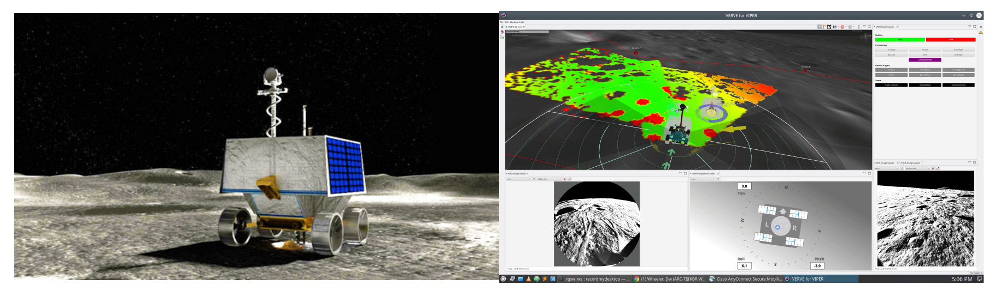
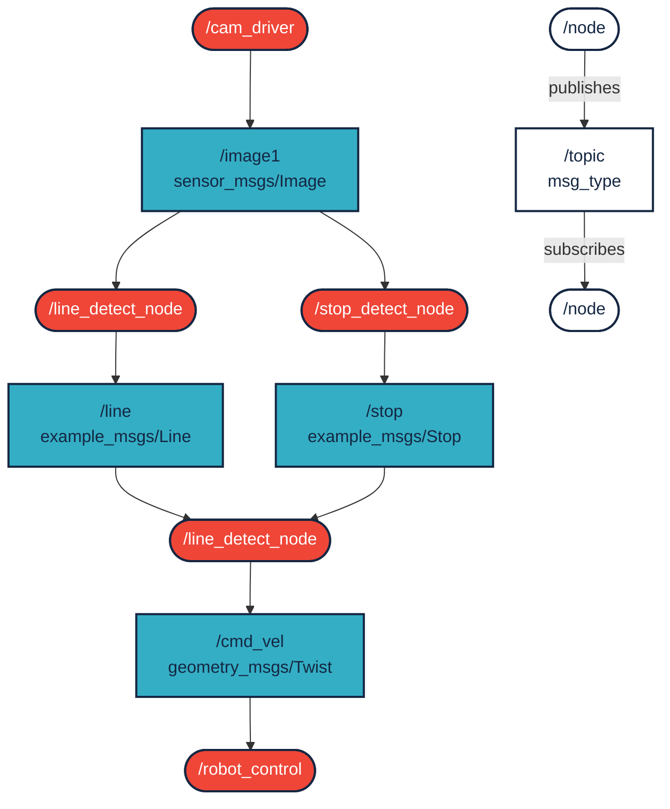
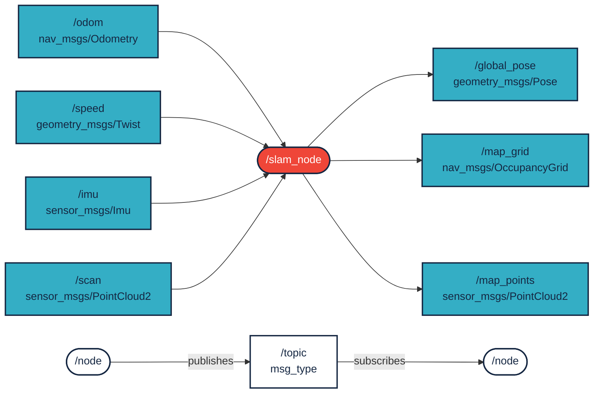
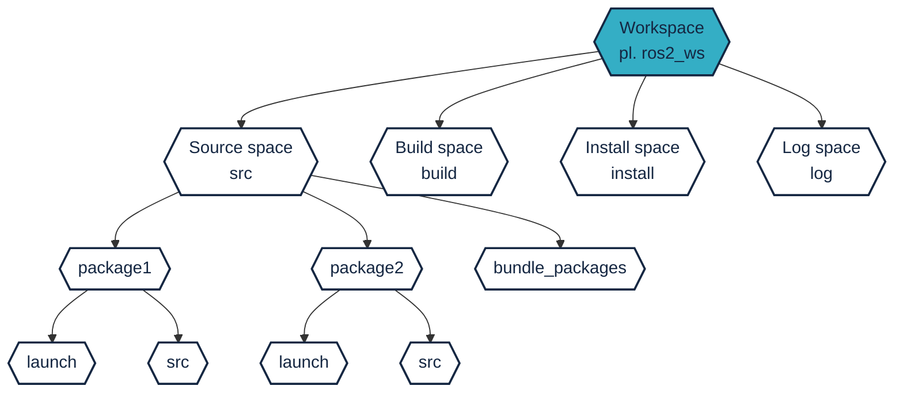
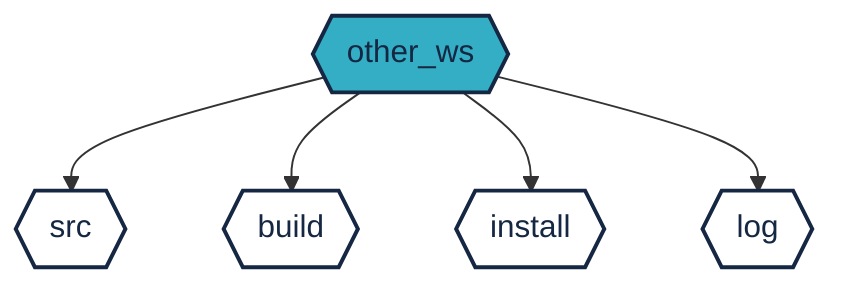
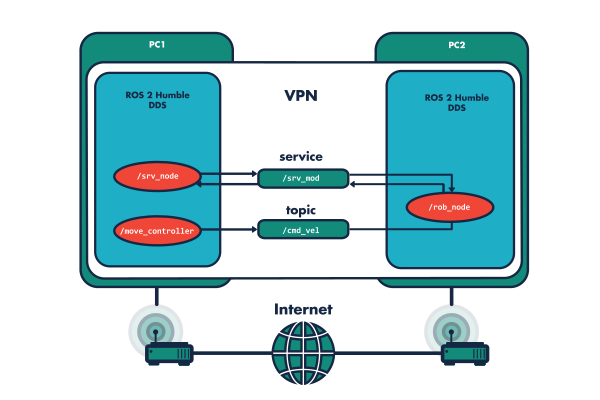
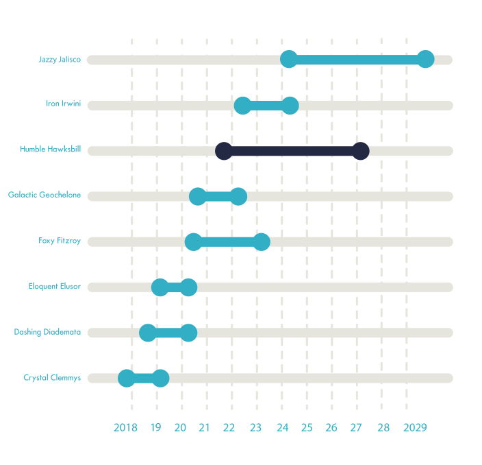
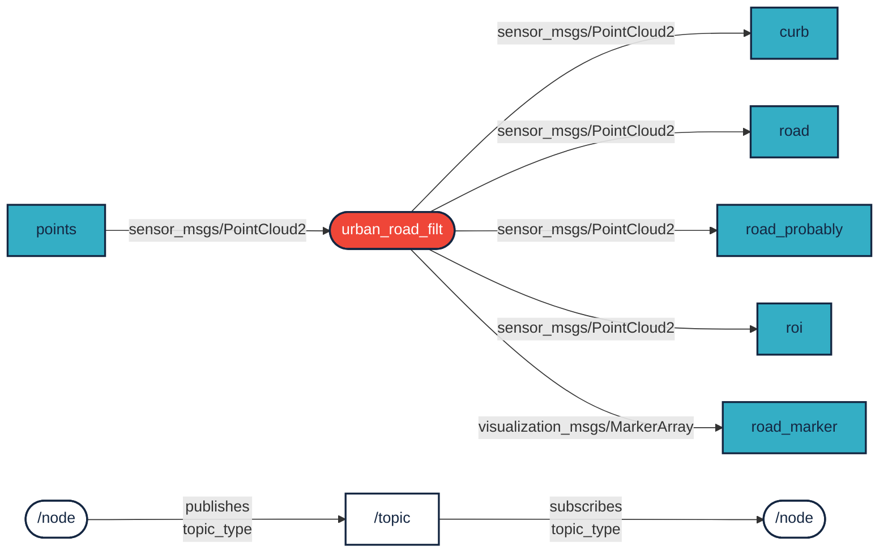

 

# `ROS 2` alapfoglamak

[ROS verziók és telepítés](https://sze-info.github.io/ajr/telepites/)


Az `ROS 2`, a `ROS` legújabb kiadása, olyan szoftverkönyvtárak és eszközök készlete (middleware), amelyek segítenek robotalkalmazások fejlesztésében. Definíció szerint a middleware egy szoftver komponenseket összekötő szoftver. Ez egy olyan réteg, amely az operációs rendszer és az alkalmazások között helyezkedik el az elosztott számítógépes hálózat mindkét oldalán. Az `ROS 2` megengedő, nyílt forráskódú, [Apache 2.0](https://choosealicense.com/licenses/apache-2.0/) licenszelést használ. 

<figure markdown="span">
  [{ width="100%" }](/bevezetes/ros_overview01.svg)
  <figcaption>ROS 2 áttekintés</figcaption>
</figure>


A `ROS` 2007-es kiadása óta inkrementális frissítéseken esett át, tehát fundamentális változások nem, nagyobb fejlesztések viszont folyamatosan történtek. 2017-ben jött rá a robotikai közösség, hogy olyan alapvető limitációi vannak az eredeti 2007-es elképzelésnek, amit ilyen inkrementális módon sajnos nem lehet javítani. Így végül a Noetic Ninjemis (2025-ig támogatva) az `ROS 1` utolsó kiadása, helyette párhuzamosan elkezdték fejleszteni az `ROS 2`-t. Ez egyben azt is jelenteti, hogy a korábbi forráskódokat nehezebben lehet portolni az új verzióra, cserébe rengeteg újdonságot, javítást, támogatást kaphatunk a fejlesztendő robotok, járművek számára.


A fentiek hatására tehát az `ROS 2` átlépett az akadémiai kutatások világából az ipari fehasználásra. Érdekesség, hogy a NASA VIPER nevű holdjárója is `ROS 2`-t futtat. Emellett olyan autóipari óriások is használják, mint a Bosch, a BMW vagy a Volvo. Robotikai cégek közül pedig számos további példát lehetne hozni. Linkek: [www.nasa.gov/viper/lunar-operations](https://www.nasa.gov/viper/lunar-operations), [rosindustrial.org/ric/current-members](https://rosindustrial.org/ric/current-members/), [www.bosch.com/stories/bringing-robotics-middleware-onto-tiny-microcontrollers](https://www.bosch.com/stories/bringing-robotics-middleware-onto-tiny-microcontrollers/). ROS felhasználók a világban: [metrorobots.com/rosmap.html](http://metrorobots.com/rosmap.html).



Kép forrása: [Robot Operating System 2: Design, Architecture, and Uses In The Wild:
Steve Macenski et al.](https://arxiv.org/pdf/2211.07752.pdf)

## Miért használjak framework-öt robotikai projektemhez?

Első robotikai projektünknél választhatjuk azt az utat, hogy framework nélkül teljesen saját megoldásként feljesztünk. Nyilván ennek is vannak előnyei (tanulás, futási gyorsaság, stb.). De hamarosan kelleni fog olyan algoritmus, amit akár mások implementáltak is, csak nem kompatibilis az eredeti elképzeléssel. Itt már célszerű meggondolni egy framework (pl a `ROS 2`) használatát. *Megjegyzés*, hogy nem a `ROS 2` az egyetlen lehetőség számos hasonló, kisebb framework létezik: <a class="http" href="http://playerstage.sf.net">Player</a>, <a class="http" href="http://eris.liralab.it/yarp/">YARP</a>, <a class="http" href="http://www.orocos.org/">Orocos</a>, <a class="http" href="http://carmen.sourceforge.net">CARMEN</a>, <a class="http" href="http://orca-robotics.sourceforge.net">Orca</a>, <a class="http" href="http://www.robots.ox.ac.uk/~pnewman/TheMOOS/index.html">MOOS</a>, and <a class="http" href="http://msdn.microsoft.com/en-us/robotics/default.aspx">Microsoft Robotics Studio</a>. Niylván mindegyiknek van előnye, ebben a tárgyban a támogatottság miatt mégis az `ROS 2`-re szoríthozunk.


Kép forrása: [ros.org/blog/ecosystem](https://www.ros.org/blog/ecosystem/)

- Plumbing: A ROS alapvetően egy üzenetküldő rendszert biztosít, amelyet gyakran "middleware"-nek vagy "plumbing"-nek neveznek. A kommunikáció az egyik első igény, amely felmerül egy új robotikai alkalmazás vagy bármilyen olyan szoftverrendszer implementálásakor, amelyhez hardverrel is csatlakozik. A ROS beépített és jól tesztelt üzenetküldő rendszere időt takaríthat meg, hiszen kezeli a kommunikáció részleteit a decentralizált csomópontok között, ezt nem kell külön implementálni. Sőt lehetőség van egy gépen Intra-process kommunikáció segítségével direkt memória elérésre is.
- Eszközök: A hatékony alkalmazások fejlesztéséhez jó fejlesztői eszközökre van szükség. A ROS rendelkezik ilyen az eszközökkel, beleértve: a hibakeresést (`rqt_console`), a vizualizációt (`Rviz2`, `Foxglove Studio`), a diagramokat (`rqt_plot`, `Foxglove Studio`), a logolást (`mcap`) és a visszajátszást. 
- Képességek: Legyen szó GPS-eszköz-illesztőprogramról, négylábú robothoz való járás- és egyensúlyszabályozóról, vagy mobil robothoz való térképezőrendszerről, a ROS-nak vannak megoldásai a problémára. A driverektől az algoritmusokig, a felhasználói felületekig a ROS biztosítja azokat az építőelemeket, amelyek lehetővé teszik, hogy a saját alkalmazására koncentráljon.
- Közösség: A ROS mögött egy nagy, globális és változatos közösség áll. Diákoktól és hobbiból űzőktől kezdve multinacionális vállalatokig és kormányzati ügynökségekig, az emberek és szervezetek minden szegmense működteti az `ROS 2` projektet. Ez azért is fontos, mert a fejlesztés során rengeteg kérdés fog felmerülni. Ezek nagy részét már meg is válaszolta aközösség, az új kérdésekre pedig szívesen válaszolnak. 

A következő ábra egy egyszerű vonalkövető robot node-jait (programjait) és topic-jait (~kommunkáció) szemléltei:


``` mermaid
graph TD;

    camd([/cam_driver]):::red --> im1[ /image1<br/>sensor_msgs/Image]:::light
    im1 --> li1([ /line_detect_node]):::red
    im1 --> st1([ /stop_detect_node]):::red
    li1 --> li2[ /line<br/>example_msgs/Line]:::light
    st1 --> st2[ /stop<br/>example_msgs/Stop]:::light
    li2 --> nav([ /line_detect_node]):::red
    st2 --> nav
    nav --> cmd[ /cmd_vel<br/>geometry_msgs/Twist]:::light
    cmd --> control([ /robot_control]):::red
    n1([ /node]):::white -- publishes --> t[ /topic<br/>msg_type]:::white
    t -- subscribes --> n2([ /node]):::white
    classDef light fill:#34aec5,stroke:#152742,stroke-width:2px,color:#152742  
    classDef dark fill:#152742,stroke:#34aec5,stroke-width:2px,color:#34aec5
    classDef white fill:#ffffff,stroke:#152742,stroke-width:2px,color:#152742
    classDef red fill:#ef4638,stroke:#152742,stroke-width:2px,color:#fff
```

Forrás: [Bestmann, Marc & Fakultät, Min & Zhang, Jianwei & Hendrich, N.. (2017). Towards Using ROS in the RoboCup Humanoid Soccer League. Masterthesis](https://www.researchgate.net/publication/337707327_Towards_Using_ROS_in_the_RoboCup_Humanoid_Soccer_League)


Nézzünk egy másik példát, ami sebességadatokból, IMU-ból, távolságadatokból készít térképeket.


``` mermaid
graph LR;

    odom[ /odom<br/>nav_msgs/Odometry]:::light --> slam([ /slam_node]):::red
    speed[ /speed<br/>geometry_msgs/Twist]:::light --> slam
    imu[ /imu<br/>sensor_msgs/Imu]:::light --> slam
    scan[ /scan<br/>sensor_msgs/PointCloud2]:::light --> slam
    n1([ /node]):::white -- publishes --> t[ /topic<br/>msg_type]:::white
    slam --> pose[ /global_pose<br/>geometry_msgs/Pose]:::light
    slam --> map_g[ /map_grid<br/>nav_msgs/OccupancyGrid]:::light
    slam --> map_p[ /map_points<br/>sensor_msgs/PointCloud2]:::light
    t -- subscribes --> n2([ /node]):::white
    classDef light fill:#34aec5,stroke:#152742,stroke-width:2px,color:#152742  
    classDef dark fill:#152742,stroke:#34aec5,stroke-width:2px,color:#34aec5
    classDef white fill:#ffffff,stroke:#152742,stroke-width:2px,color:#152742
    classDef red fill:#ef4638,stroke:#152742,stroke-width:2px,color:#fff
```


## `ROS 2` mappaszerkezet


``` bash
~/ros2_ws$ ls

build  install  log  src
```


``` mermaid
graph TD;

    W1{{ Workspace</br>pl. ros2_ws }}:::light --> S1{{ Source space</br>src }}:::white
    W1 --> B1{{ Build space</br>build }}:::white
    W1 --> I1{{ Install space</br>install }}:::white
    W1 --> L1{{ Log space</br>log }}:::white
    S1 --> P1{{ package1 }}:::white
    S1 --> P2{{ package2 }}:::white
    S1 --> P3{{ bundle_packages }}:::white
    P1 --> LA1{{ launch }}:::white
    P1 --> SR1{{ src }}:::white
    P2 --> LA2{{ launch }}:::white
    P2 --> SR2{{ src }}:::white

    classDef light fill:#34aec5,stroke:#152742,stroke-width:2px,color:#152742  
    classDef dark fill:#152742,stroke:#34aec5,stroke-width:2px,color:#34aec5
    classDef white fill:#ffffff,stroke:#152742,stroke-width:2px,color:#152742
    classDef red fill:#ef4638,stroke:#152742,stroke-width:2px,color:#fff
```


``` mermaid
graph TD;

    W2{{ other_ws }}:::light --> S2{{ src }}:::white
    W2 --> B2{{ build }}:::white
    W2 --> I2{{ install }}:::white
    W2 --> L2{{ log }}:::white

    classDef light fill:#34aec5,stroke:#152742,stroke-width:2px,color:#152742  
    classDef dark fill:#152742,stroke:#34aec5,stroke-width:2px,color:#34aec5
    classDef white fill:#ffffff,stroke:#152742,stroke-width:2px,color:#152742
    classDef red fill:#ef4638,stroke:#152742,stroke-width:2px,color:#fff
```

``` bash
~/ros2_ws/
├──build  
├──install  
├──log
└──src/
    ├── bundle_packages 
    │   ├── cone_detection_lidar
    │   │   ├── launch
    │   │   └── src
    │   ├── my_vehicle_bringup
    │   │   └── launch
    │   ├── other bundle package1
    │   ├── other bundle package2
    │   └── img
    └── wayp_plan_tools
        ├── csv
        ├── launch
        └── src
```

## Különbségek az `ROS 1` és `ROS 2` között 

- *Változások a Middleware-ben*  
  A `ROS 1` a Master-Slave architektúrát és az XML-RPC middleware-t használja. A `ROS 2` ezzel szemben a  Data Distribution Service (DDS) használ, amely nagyobb hatékonyságot és megbízhatóságot, alacsony késleltetést és skálázhatóságot, valamint konfigurálható szolgáltatásminőségi (QoS) paramétereket biztosít. Többek között így nem kell `roscore`-t indítani. Az XML-RPC jobb az egyszerű távoli eljáráshívásokhoz, míg a DDS hozzáadott komplexitása lehetővé teszi, hogy jobban támogassa a valós idejű rendszereket.
- *Változások a ROS API-ban*  
  A `ROS 1` két különálló könyvtárral rendelkezik: a C++ nyelvhez készült `roscpp` és a Pythonhoz készült `rospy`. Ezek nem teljesen azonosak egymással a funkciók tekintetében. Ezzel szemben a `ROS 2` egy C nyelven írt alapkönyvtárral - `rcl` (ROS klienskönyvtár) - rendelkezik, amelyre könyvtárak épülnek. Ez biztosítja, hogy az alapvető funkciók hamarabb elérhetők legyenek a különböző API-kban. Ez az egyik fő oka annak, hogy a `ROS 2` a korábbi Pythonon és a C++-on kívül több nyelvi támogatást is képes nyújtani: például  [rclada](https://github.com/ada-ros/rclada) Ada, [rclcpp](https://github.com/ros2/rclcpp) C++, [rclgo](https://github.com/juaruipav/rclgo) Go,  [rclpy](https://github.com/ros2/rclpy) Python, [rcljava](https://github.com/esteve/ros2_java/tree/master/rcljava)  Java, [rclnodejs](https://github.com/RobotWebTools/rclnodejs) Node.js,  [rclobjc](https://github.com/esteve/ros2_objc) Objective C (iOS),  [rclc](https://github.com/ros2/rclc) C, [ros2_rust](https://github.com/ros2-rust/ros2_rust) Rust, [ros2_dotnet](https://github.com/esteve/ros2_dotnet) .NET, [ros2cs](https://github.com/RobotecAI/ros2cs) ros2_dotnet alternatíva C# nyelven.
 
- *Változások az adatformátumban*  
  A `ROS 2` az `MCAP` formátumot használja, ami nem dedikáltan az ROS saját formátuma, hanem egy nyílt forráskódú konténerfájl-formátum multimodális log-adatokhoz. Támogatja az időbélyegzővel ellátott, előre sorba rendezett adatokat, és ideális a pub/sub vagy robotikai alkalmazásokban való használatra. Bővebben: [mcap.dev](https://mcap.dev/)


## Pár hasznos újítás
- *Valós idejű feldolgozás*  
  A fenti funkciók összegzése, valamint a DDS használata lehetővé teszi, hogy a `ROS 2` kiválóan alkalmas legyen a valós idejű (real time) feldolgozásra, különösen akkor, ha determinisztikus, alacsony késleltetésű kommunikációra van szükség.
- *QoS: Quality of Service* 
  A `ROS 2` lehetővé teszi az adatáramlás konfigurálását, ami befolyásolja az adatok küldésének és fogadásának módját. Ez magában foglalja az üzenetek megbízhatóságára, határidejére és prioritására vonatkozó beállításokat, amelyek biztosíthatják, hogy a kritikus üzenetek időben kézbesítésre kerüljenek. 
- *Többszálú végrehajtás*  
  A `ROS 2` támogatja a több csomópont valóban párhuzamos futtatását, így a modern többmagos processzorok sokkal jobban kihasználhatók, mint a `ROS 1` esetében. 


Forrás: [husarnet.com/blog/ros2-docker](https://husarnet.com/blog/ros2-docker)

## Egyéb változások
- A Catkin eltűnt, helyére az Ament (Colcon) lépett, mint build rendszer. Az overlay-ek lehetővé teszik egy másodlagos munkaterület létrehozását, amely nem befolyásolja az elsődleges munkaterületet - ez akkor hasznos, ha új csomagokkal kell kísérletezni, de úgy, hogy ez ne befolyásolja az alapkonfigurációt (ezt "underlay"-nek hívják).
- A `ROS 2` visszafelé nem kompatibilis a `ROS 1`-gyel. Következésképpen a `ROS 1` csomagok valószínűleg nem fognak működni a `ROS 2`-vel, és átdolgozást igényelnének, és más szoftverek, amelyeket a `ROS 1`-gyel szoktál használni, már nem fognak működni.
- A `ROS 1` elsősorban az Ubuntu számára készült. A `ROS 2` fut MacOS, Windows, Ubuntu és más (akár Real-Time) operációs rendszereken is.

## Verziók

[ROS verziók és telepítés](https://sze-info.github.io/ajr/telepites/)



Distrok százalékos megoszlása az időben: [metrics.ros.org/rosdistro_rosdistro.html](https://metrics.ros.org/rosdistro_rosdistro.html)

[](https://docs.ros.org/en/humble/)

A `Humble Hawksbill` vagy röviden `Humble` egy long term support (LTS) release, 5 évig támogatott (2022 májusától 2027 májusáig)

További release-ek: [docs.ros.org/en/humble/Releases.html](https://docs.ros.org/en/humble/Releases.html)

<iframe width="560" height="315" src="https://www.youtube.com/embed/0aPbWsyENA8?rel=0" title="YouTube video player" frameborder="0" allow="accelerometer; autoplay; clipboard-write; encrypted-media; gyroscope; picture-in-picture; web-share" allowfullscreen></iframe>

# Koncepciók

## Nodes 

A node legegyszerűbben fogalmazva ROS programot (magyarosítva csomópont) jelent. Ábrán kerek 🔴 jelöléssel feltünteve. Jellemzőik:

- "Végrehajthatóak" (c++ / py).
- Minden node egy folyamat
- ROS kezeli a szálakat (threading).
- Egy node belsejében több szál is lehet.
- publish/subscribe topic-okra. 
- Több node is "közzétehet" egy topicra, és egy node több topicot is "meghallgathat".

## Topics

A topic-ok felfoghatóak egy nevesített "portnak", ahol a node-ok kommunkálni tudnak. Ábrán szögletes 🟦 jelöléssel feltünteve. Jellemzőik:

- A node-ok közötti információ áramlásért felel.
- Minden topic típusát az "üzenet" határozza meg
- A node-ok között megengedett a "many-to-many" kommunikáció 

## Messages

- Egy topic tartalmát és szerkezetét az üzenet határozza meg
- Alkalmazásprogramozási interfész (API) a Node-ok számára .msg  kiterjesztésű fájlokban vannak definiálva

### Üzenetek típusai 
- Primitive built-in types (std_msgs)
  - `bool`, `string`, `float32`, `int32`, `…`
- Higher-level built in types:
  - `geometry_msgs`: `Point`, `Polygon`, `Vector`, `Pose`, `PoseWithCovariance`, `…`
  - `nav_msgs`: `OccupancyGrid`, `Odometry`, `Path`, `…`
  - `sensors_msgs`: `Joy`, `Imu`, `NavSatFix`, `PointCloud`, `LaserScan`, …
- Támogatottak továbbá:
  - Konstansok
  - Felsorolások
  - Beágyazott definíciók

Példa:

``` c
$ ros2 interface show geometry_msgs/msg/Point
float64 x
float64 y
float64 z
```

``` c
$ ros2 interface show std_msgs/msg/Header
uint32 seq
time stamp
string frame_id
```

A `Header` és a`Point` a típusból épül fel a `PoseStamped` típus struktúrája:

```  { .bash .annotate }
$ ros2 interface show geometry_msgs/msg/PoseStamped
std_msgs/Header header
  uint32 seq
  time stamp
  string frame_id
geometry_msgs/Pose pose
  geometry_msgs/Point position # (1) 
    float64 x
    float64 y
    float64 z
  geometry_msgs/Quaternion orientation # (2)
    float64 x
    float64 y
    float64 z
    float64 w

```
{ .annotate }

1.  :man_raising_hand: Ez már ismerős lehet: a `geometry_msgs/msg/Point`-ről már beszéltünk.
2.  :man_raising_hand: `geometry_msgs/Quaternion` egyfajta 3D orientáció reprezentáció, erről később részletesen.

## Publishing / Subscribing

A következőkben az `urban_road_filt` nevű node a `points` adatokra iratkozik fel, ami `PointCloud2` típusú, és hirdet `PointCloud2`, `MarkerArray` típusú üzeneteket:


```mermaid
flowchart LR

P[points]:::light -->|sensor_msgs/PointCloud2| U([urban_road_filt]):::red
U --> |sensor_msgs/PointCloud2| A[curb]:::light
U --> |sensor_msgs/PointCloud2| B[road]:::light 
U --> |sensor_msgs/PointCloud2| C[road_probably]:::light
U --> |sensor_msgs/PointCloud2| D[roi]:::light
U --> |visualization_msgs/MarkerArray| E[road_marker]:::light

n1([ /node]):::white -- publishes</br>topic_type --> t[ /topic]:::white
t -- subscribes</br>topic_type --> n2([ /node]):::white

classDef light fill:#34aec5,stroke:#152742,stroke-width:2px,color:#152742  
classDef dark fill:#152742,stroke:#34aec5,stroke-width:2px,color:#34aec5
classDef white fill:#ffffff,stroke:#152742,stroke-width:2px,color:#152742
classDef red fill:#ef4638,stroke:#152742,stroke-width:2px,color:#fff

```

## Parameters
- Publish/Subscribe segítségével nem írható le minden
- A Node-oknak néha szükségük lehet paraméterezésre
- Paraméterek lehetnek:
  - Vezérlő típusa
  - Szín küszöbértékek; 
  - Kamera felbontás, stb

## Launch fájlok

Több node (ROS program) kötegelt végehajtása. Megtartva az `ROS 1`konvenciókat lehet XML formátumú fájl, amely az ROS szinte minden aspektusát / műveletét meghatározhatja. Újabban viszont ezek `python` fájlok is lehetnek, így sokkkal nagyobb szabadságunk van. Node indítás, paraméterek beállítása / betöltése, topic leképezése, parancssori argumentumok átadása.

Erről egy rövid videó:

<iframe width="560" height="315" src="https://www.youtube.com/embed/PqNGvmE2Pv4?rel=0" title="YouTube video player" frameborder="0" allow="accelerometer; autoplay; clipboard-write; encrypted-media; gyroscope; picture-in-picture; web-share" allowfullscreen></iframe>


# Források
- [docs.ros.org/en/humble](https://docs.ros.org/en/humble/)
- [ros.org/blog/ecosystem](https://www.ros.org/blog/ecosystem/)
- [husarnet.com/blog/ros2-docker](https://husarnet.com/blog/ros2-docker)
- [design.ros2.org/articles/intraprocess_communications.html](https://design.ros2.org/articles/intraprocess_communications.html)
- [Towards Using ROS in the RoboCup Humanoid Soccer League - Masterthesis](https://www.researchgate.net/publication/337707327_Towards_Using_ROS_in_the_RoboCup_Humanoid_Soccer_League)

