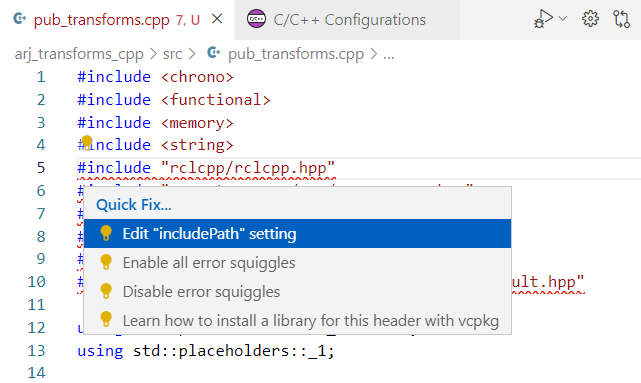
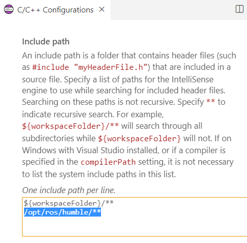

 

# VS code és Git

A `VS code` Linux, Windows és Mac rendszerekre készült egyszerű kód és szövegszerkezstő, amely különböző kiegészítésekkel egy teljes értékű IDE (integrált fejlesztőkörnyezet) lehet. Neve a Visual Studio Code rövidítése, ingyenes, nyílt forráskódú, a Microsoft fejleszti.
Népszerű fejlesztőkörnyezet (pl. 2021-ben a Stack Overflow Developer Survey alapján 82000 válaszadóból 70% használta, így az egyik legnépszerűbb IDE).

## Navigáció a fejlesztőkörnyezetben

A következőkben a fontosabb feleületeket mutatjuk be.

Talán az egyik legfontosabb billentyűkombináció a `Ctrl-Shift-P`, mellyel a Command Palette jön elő, ahol beállítások, fájlok, parancsok között böngészhetünk.

## Source control (forráskezelés) áttetintése

A forráskezelő szoftvereket, mint például a Git, a következő okok miatt használjuk a modern szoftverfejlesztésben:

- Változáskövetés: Lehetővé teszik a forráskód minden módosításának nyomon követését, így könnyen vissza lehet térni korábbi verziókhoz, ha hibát fedeznek fel, vagy ha egy új funkció nem működik megfelelően.
- Együttműködés: Több fejlesztő egyidejűleg dolgozhat ugyanazon a projekten. A forráskezelő szoftverek segítenek kezelni a különböző változtatásokat és megoldani az esetleges ütközéseket.
- Biztonsági mentés: A projekt minden verzióját tárolja, így ha valami elromlik vagy elveszik, könnyen vissza lehet állítani az előző állapotot.
- "Kísérletezés": Lehetővé teszi a fejlesztők számára, hogy különböző verziókat vagy ágakat (branch) hozzanak létre, és új funkciókat vagy javításokat próbáljanak ki anélkül, hogy befolyásolnák a fő projektkódot.
- Dokumentálás: A forráskezelő rendszerekben lehetőség van a módosításokhoz kapcsolódó üzenetek (commit message) rögzítésére, ami segíti a változtatások okainak és céljainak dokumentálását.
- Integráció és folyamatos fejlesztés: Segítik az automatikus tesztelést és a folyamatos integrációs folyamatokat (CI/CD), mivel biztosítják, hogy minden változtatás könnyen kezelhető és nyomon követhető legyen.

## Git source control (forráskezelés) használata a VS Code-ban

A Visual Studio Code integrált forráskezeléssel (SCM) rendelkezik, és tartalmazza a [Git](https://git-scm.com/) támogatást. Sok más forráskezelő szolgáltató érhető el a [extensions](https://code.visualstudio.com/docs/editor/extension-marketplace.md) oldalon a VS Code Marketplace-en.

<iframe width="560" height="315" src="https://www.youtube.com/embed/i_23KUAEtUM?rel=0" title="A Git használata Visual Studio kóddal (hivatalos kezdő oktatóanyag)" frameborder="0" engedélyezi ="gyorsulásmérő; autoplay; clipboard-write; encrypted-media; giroszkóp; kép a képben" allowfullscreen></iframe>

### Git repository 

>**Győződjön meg arról, hogy a Git telepítve van.** A VS Code a számítógépe Git-telepítését fogja használni (legalább `2.0.0` verzió szükséges), ezért [telepítenie kell a Git-et](https://git-scm.com/download ), mielőtt ezeket a szolgáltatásokat igénybe vehetné.

A bal oldali tevékenységsávban található `Source control` ikon mindig **áttekintést ad arról, hogy hány változás** van jelenleg a tárhelyen (repo). Az ikon kiválasztásával megjelennek az aktuális adattár-módosítások részletei: **CHANGES**, **STAGED CHANGES** és **MERGE CHANGES**.

Az egyes elemekre kattintva részletesen megtekintheti **az egyes fájlokon belüli szöveges változásokat**. Vegye figyelembe, hogy a nem szakaszos módosítások esetén a jobb oldali szerkesztő továbbra is lehetővé teszi a fájl szerkesztését.

A **repo státuszára** vonatkozó indikátorokat is megtalálhatók a VS Code bal alsó sarkában: az **aktuális branch (current branch)**, **dirty indicators**, valamint a **bejövő és kimenő commitok száma.** az aktuális ágból. A tárhely bármely ágát **checkout-olhatja**, ha rákattint az állapotjelzőre, és kiválasztja a Git hivatkozást a listából.

!!! tip
    A VS Code-ot megnyithatjuk egy Git-repo könyvtárában. Ehhez a parancs a könytárban állva: `code .` illetve pl: `code ~/ros2_ws/src/arj_packages/`, ha a tantárgy `arj_packages` repoját szereténk megnyitni. A VS Code Git szolgáltatásai továbbra is a szokásos módon működnek, és minden változást megjelenítenek a tárolón belül, de a hatókörű könyvtáron kívüli fájlmódosítások egy eszköztippel vannak árnyékolva, jelezve, hogy az aktuális munkaterületen kívül helyezkednek el.

## Commit

Az **staging** (git add) és **unstaging** (git reset) végrehajtható a fájlok kontextus szerinti műveleteivel vagy húzással.

>**Konfigurálja a Git-felhasználónevét és e-mail-címét.** Commitoláskor, figyelni kell, hogy ha a felhasználónév és/vagy e-mail-cím be legyen állítva a Git-konfigurációban. Részletek: [Git commit information] (https://git-scm.com/docs/git-commit#_commit_information).

Beírható egy commit üzenetet a változtatások jelzésére, ezután `kbstyle(Ctrl+Enter)` (macOS: `kbstyle(⌘+Enter)`) billentyűt kell ütni a véglegesítéshez. Ha vannak változtatások(staged chnages), csak azokat a változtatásokat hajtják végre. Ellenkező esetben a rendszer kéri, hogy válassza ki, milyen változtatásokat szeretne végrehajtani.

Például a korábbi képernyőképen csak az "overview.png" szakaszos módosításai szerepelnek a véglegesítésben. A későbbi szakaszolási és véglegesítési műveletek külön véglegesítésként tartalmazhatják a "versioncontrol.md" és a másik két ".png" kép módosításait.

A pontosabb **Commit** műveletek a forráskezelés nézet tetején található **Views and More Actions** `...` menüben találhatók.

> **Tipp:** Ha rossz ágon (branch) hajtja végre a módosítást, vonja vissza a véglegesítést a **Command Palette** **Git: Undo Last Commit (Utolsó commit visszavonása)** paranccsal (`Ctrl+Shift+P`).

<iframe src="https://www.youtube.com/embed/E6ADS2k8oNQ" width="640" height="320" allowFullScreen="true" frameBorder="0?rel=0" title="Git: Végrehajtás a Visual Studio Code-ban" ></iframe>

### Repo klónozása

Ha még nincs klónozva repository, akkor a Forráskezelés nézetben a **Open Folder** a helyi gépről vagy a **Clone Repository** (távoli gépről) lehetőségek közül választhat.

A **Clone Repository** lehetőséget választva, a rendszer meg fogja kérni a távoli tárhely URL-címét (például a [GitHubon](https://github.com/)) és azt a könyvtárat, amelybe a helyi tárat helyezi.

GitHub-tárhely esetén az URL-t a GitHub **Kód** párbeszédpanelen találja meg.

Ezután illessze be ezt az URL-t a **Git: Clone** promptba.

Megjelenik a **Clone from GitHub** lehetőség is. Miután hitelesítette GitHub-fiókját a VS Code-ban, kereshető válnak a saját (akár privát) repók is, név alapján.

## Beépített terminal

A fejlesztőkörnyezet beépített terminálja, mind Windowson, mind Linuxon működik.

## Hasznos tudni
- pl `code .` megnyintja az aktuális mappa tartalmát
- pl `code ~/.bashrc` megnyintja a  `~/.bashrc` tartalmát szerkesztésre

## WSL VS code videó

<iframe width="560" height="315" src="https://www.youtube.com/embed/fAkpQ4Q3S2g?rel=0" title="YouTube video player" frameborder="0" allow="accelerometer; autoplay; clipboard-write; encrypted-media; gyroscope; picture-in-picture; web-share" allowfullscreen></iframe>

## ROS 2 ajánlott beállítások

ROS 2 C++ fejlesztésnél alapvetően a VS code nem ismeri fel az ROS header fájlokat, így az pl az [IntelliSense](https://code.visualstudio.com/docs/editor/intellisense) se működik megfelelően:

<figure markdown="span">
  
  <figcaption>Includepath VS code-ban</figcaption>
</figure>

Erre egyszerű megoldás az `includePath settings`-re kattintva beállítani az `/opt/ros/humble/**` elérési utat. (Természetesen ugyanez működik nem `humble` verziónál is, ott a megfelelő elérési utat szükséges megadni). Ez a következőképp néz ki:

<figure markdown="span">
  
  <figcaption>Includepath settings VS code-ban</figcaption>
</figure>

Amennyiben mentette a VS code, az [IntelliSense](https://code.visualstudio.com/docs/editor/intellisense) és egyéb funkciók is ennek megfelelően fognak működni.

Források: [code.visualstudio.com/docs/sourcecontrol/overview](https://code.visualstudio.com/docs/sourcecontrol/overview)