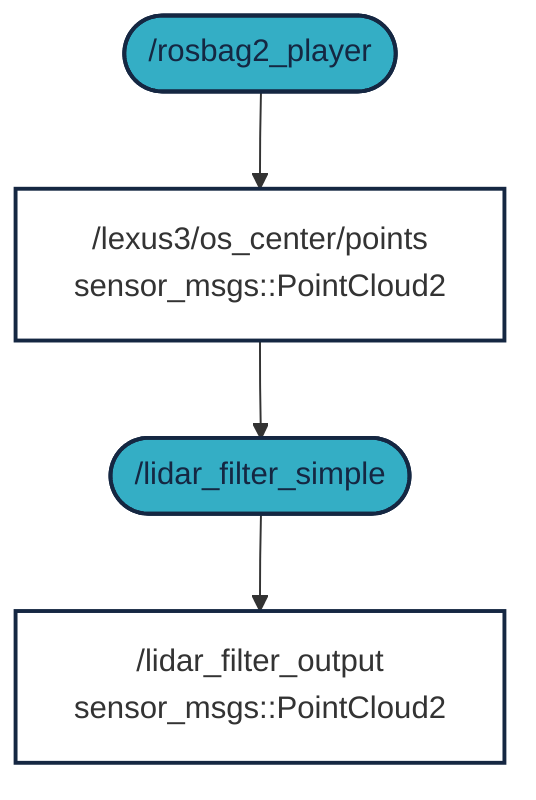
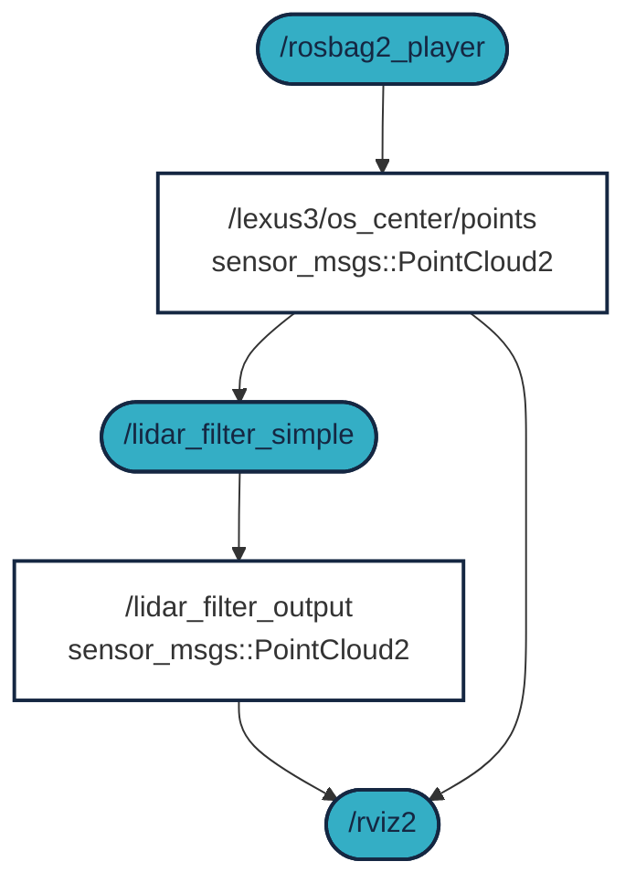

 


# Előkészületek

Korábbi gyakorlaton megismerkedtünk a rosbag formátummal (ROS 2-ben a formátum már `.mcap`). 

Előkészületként nézzük meg, hogy létezik-e a `C:\temp` könyvtár

``` c
test -d "/mnt/c/temp" && echo Letezik || echo Nem letezik
```
Vagy egyszerűbben:
``` c
ls /mnt/c/temp
```

- Ha nem létezik (`No such file or directory`), akkor hozzuk létre: `mkdir /mnt/c/temp`
- Ha létezik, akkor nincs teendőnk, lépjünk a következő lépésre, másoljuk át ide az `.mcap` fájlokat


Tanteremben a másolás a következő parancsok **egyike** legyen:

``` r 
rsync -avzh --progress /mnt/kozos/measurement_files/lexus3sample01.mcap  /mnt/c/temp/
```

``` r 
rsync -avzh --progress /mnt/kozos/measurement_files/lexus3sample02.mcap  /mnt/c/temp/
```

``` r 
rsync -avzh --progress /mnt/kozos/measurement_files/lexus3sample03.mcap  /mnt/c/temp/
```

``` r 
rsync -avzh --progress /mnt/kozos/measurement_files/lexus3sample04.mcap  /mnt/c/temp/
```


Otthon a következő linkről (zöld gomb), vagy parancsként `wget`-el lehet letölteni:

```r 
wget  -O lexus3sample02.mcap https://laesze-my.sharepoint.com/:u:/g/personal/herno_o365_sze_hu/EakTOhcjblNInqjRMfaGVmsB0diDv0SWpXw9rwo0MD7f3w?download=1
```

[Rosbag letöltése 300 MB](https://laesze-my.sharepoint.com/:u:/g/personal/herno_o365_sze_hu/EakTOhcjblNInqjRMfaGVmsB0diDv0SWpXw9rwo0MD7f3w?download=1){: .md-button } 


# `1.` feladat

A feladat egyszerű LIDAR szűrés, X, Y és Z koordináták szerint.


Ha még nem tettük volna, klónozzuk az `arj_packages` repot és buildeljük az `arj_simple_perception` package-t.

``` r
cd ~/ros2_ws/src
```

``` r
git clone https://github.com/sze-info/arj_packages
```

Ha már létezik, akkor az előző lépés helyett, csak frissítsük.

``` r
cd ~/ros2_ws/src/arj_packages/
```

``` r
git status
```

``` r
git checkout -- .
```

``` r
git pull
```
A `git checkout -- .` az összes esetleges lokális változás visszavonására jó.

``` r
cd ~/ros2_ws
```

``` r
MAKEFLAGS="-j4" colcon build --packages-select arj_simple_perception --cmake-args -DCMAKE_BUILD_TYPE=Release
```

!!! tip
    A klasszikus `colcon build --packages-select arj_simple_perception` is működik, csupán egy kicsit lassabb, ezért használjuk most a build flageket. 
    További olvasnivaló a [Troubleshooting](/ajr/onallo/troubleshoot/) fejezetben.


``` r
source ~/ros2_ws/install/setup.bash
```

``` r
ros2 run arj_simple_perception lidar_filter_simple
```

``` r 
ros2 bag play /mnt/c/temp/lexus3sample02.mcap --loop --clock --rate 0.5 --read-ahead-queue-size 2048
```

Nézzük meg, hogy a következő toicok léteznek-e?
- `/lexus3/os_center/points`
- `/lidar_filter_output`


``` r
ros2 topic list
```

Kérdezzük le a topicok típusát.

``` r
ros2 topic type /lidar_filter_output
```

``` r
ros2 topic type /lexus3/os_center/points
```

Mindkét esetben `sensor_msgs/msg/PointCloud2` kell, hogy legyen.

``` r
ros2 topic echo /lexus3/os_center/points --once --field header
```
``` r
stamp:
  sec: 1712321465
  nanosec: 957581201
frame_id: lexus3/os_center_a_laser_data_frame
---
```

!!! note
    A `frame_id` lehet pl. `lexus3/os_center_a_laser_data_frame` vagy `lexus3/os_center_a`, stb. Ez RVIZ-ben fontos lehet.

Vizsgáljuk meg közelebbről a node-ot.

``` r
ros2 node info /lidar_filter_simple
```

``` r
Subscribers:
    /lexus3/os_center/points: sensor_msgs/msg/PointCloud2
    /parameter_events: rcl_interfaces/msg/ParameterEvent
Publishers:
    /lidar_filter_output: sensor_msgs/msg/PointCloud2
    /parameter_events: rcl_interfaces/msg/ParameterEvent
    /rosout: rcl_interfaces/msg/Log
```


Új terminalban vizsgáljuk meg a gráfot:

``` r 
ros2 run rqt_graph rqt_graph
```





# `2.` feladat

Nyissuk meg VS code-ban a package-t:

``` r
code ~/ros2_ws/src/arj_packages/arj_simple_perception
```

Hasnolítsuk össze a `lidar_filter_simple_param.cpp`-t a `lidar_filter_simple.cpp`-vel. Vs code jobb kilikk a fájlon `Select for compare` és `Compare with Selected`.


Az előző feladatban használt egyszerű filter minimum és maximum X,Y,Z értékeit dinamikusan változtassuk.

``` r
source ~/ros2_ws/install/setup.bash
```

``` r
ros2 run arj_simple_perception lidar_filter_simple_param
```

``` r
source ~/ros2_ws/install/setup.bash
```

``` r
ros2 launch arj_simple_perception run_rviz1.launch.py
```

Állítsuk át a paramétereket:

``` r
ros2 run rqt_reconfigure rqt_reconfigure
```

A 3 terminal helyett használhatunk egy `launch` fájlt is:
``` r
source ~/ros2_ws/install/setup.bash
```

``` r
ros2 launch arj_simple_perception run_all.launch.py
```

Nagyjából így fog kinézni az `rqt_reconfigure` meg az `rviz2`:


# Önálló feladat 1

Írjunk egy launch fájlt, nevezzük `run_filter_and_rviz.launch.py`-nak, ami a filtert és az rviz configot indítja. Így lehessen indítani:

``` r
ros2 launch arj_simple_perception run_filter_and_rviz.launch.py
```



# Önálló feladat 2

Módosítsuk a `lidar_filter_simple_param.cpp`-t, úgy, hogy amennyiben a minimum érték nagyobb, mint a maximum, akkor is működjön. Ebben az esetben kezelje a minimum értéket maximumként és fordítva.

Írjon ki egy `warning` üzenetet.

``` cpp
if ...
RCLCPP_WARN_STREAM(this->get_logger(), "Minimum is bigger than maximum, inverse usage.");
```

!!! Tip
    Szebb megoldás a `IncludeLaunchDescription` - `PythonLaunchDescriptionSource` használata. Példa lehet a [ros2launchmarker.md](/ajr/onallo/ros2launchmarker/#launch-fajl-letrehozasa) fejezetben található kódrészlet.

# Utolsó lépések

A tanteremben állítsuk vissza az eredeti állapotot. (Otthon commitolhatjuk saját repo-ba, ha szeretnénk.)

``` bash
cd ~/ros2_ws/src/arj_packages/
```
``` bash
git status
```
A `git checkout -- .`: Minden nem staged (unstaged) változás elvetése lokálisan. VS code-ban kb ez a "discard all changes" parancs lenne.
``` bash
git checkout -- .
```
Nézzük __újra__ a státuszt:

``` bash
git status
```

``` bash
git pull
```