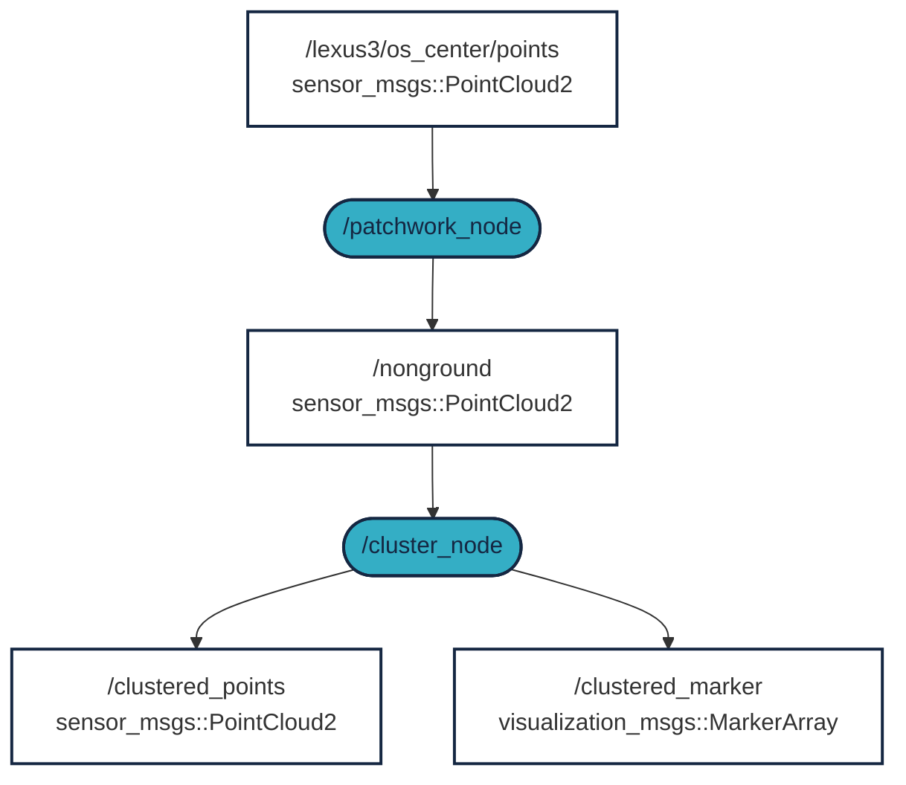

 


# ROS 2 LIDAR klaszterezés

A rövid gyakorlat / workshop célja, hogy a LIDAR adatok objektumokká történő szűrését bemutassa. Tehát az egyes LIDAR pontoból nagyobb objektumoat / klasztereket készítünk. Ezek az objektumok lehetnek gyalogosok, autók, épületek stb. A gyakorlat ROS 2 kompatibilis. [](https://docs.ros.org/en/humble/)

## Követelmények (magas szintű áttekintés)
1. ROS 2 Humble: 🟠 lásd a korábbi tananyagok vagy a [docs.ros.org/en/humble/Installation.html](https://docs.ros.org/en/humble/Installation.html)
2. Logfájl nyers LIDAR adatokkal (MCAP formátum, bag) ✅
3. A `patchworkpp` csomag az alapsík kiszűrésére ✅
4. A `lidar_cluster` csomag a klaszterezés végrehajtásához ✅


## Videó áttekintése

A következő képernyőfelvétel bemutatja a szükséges lépéseket:

<iframe width="560" height="315" src="https://www.youtube.com/embed/YJyczb53vrg?si=rqnKHgE7y70-5B3a" title="YouTube video player" frameborder="0" allow="accelerometer; autoplay; clipboard-write; encrypted-media; gyroscope; picture-in-picture; web-share" referrerpolicy="strict-origin-when-cross-origin" allowfullscreen></iframe>

## `0. lépés` - Előfeltételek
Mielőtt elkezdenénk, győződjünk meg arról, hogy a következő előfeltételek teljesülnek:

- Van egy működő `ROS 2 Humble` telepítésünk
- Van egy `ros2_ws` workspace-ünk
- `pcl-ros` telepítve van

=== "Humble"

    ```bash
    sudo apt install ros-humble-pcl-ros
    ```

=== "Jazzy"

    ```bash
    sudo apt install ros-jazzy-pcl-ros
    ```

=== "Általános"

    ```bash
    sudo apt install ros-$ROS_DISTRO-pcl-ros
    ```

Tanteremben futtassuk ezt a parancsot:


``` bash
/mnt/kozos/script/update_ros2_key.sh
```

További olvasnivaló a [Troubleshooting](/ajr/onallo/troubleshoot/) fejezetben.

## `1. lépés.` - Ha még nincs meg korábbról, töltsük le a nyers adatokat

A LIDAR adatok klaszterezéséhez először – nem meglepő módon – LIDAR adatokra van szükség. Használja a következő 3 lehetőség valamelyikét, amennyiben még nincs meg az elsőző gyakorlatokból.

### `A lehetőség`: MCAP letöltése az alábbi linkről

[Download MCAP [~540MB] :material-download: ](https://laesze-my.sharepoint.com/:u:/g/personal/herno_o365_sze_hu/Eclwzn42FS9GunGay5LPq-EBA6U1dZseBFNDrr6P0MwB2w?download=1){ .md-button }

Példáinkban az `.mcap` fájl a `/mnt/c/bag/` mappába kerül mentésre. Ha másik könyvtárat szeretne használni, kérjük, módosítsad azt ennek megfelelően.

### `B lehetőség`: Töltsük le MCAP-unkat a terminálján keresztül

<details>
<summary> Ne felejtse el először a könyvtárat módosítani.</summary>

Esetünkben a `/mnt/c/bag/` a hely, ahova tenni fogjuk:

``` bash
cd /mnt/c/bag/
```
</details>

```
wget https://laesze-my.sharepoint.com/:u:/g/personal/herno_o365_sze_hu/Eclwzn42FS9GunGay5LPq-EBA6U1dZseBFNDrr6P0MwB2w?download=1  -O lexus3-2024-04-05-gyor.mcap
```
Tanteremben ez így néz ki:
``` bash
rsync -avzh --progress /mnt/kozos/measurement_files/lexus3-2024-04-05-gyor.mcap /mnt/c/temp/
```
Windows böngészőből is meg lehet tenni, de a terminálból csak egy parancs. 


### `C lehetőség`: Saját MCAP használata
Használhatunk saját MCAP fájt, de ebben az esetben a következőket kell módosítani:

- A LIDAR topic
 - Példánkban ez a `/lexus3/os_center/points`
- LIDAR frame
 - Példánkban ez a `lexus3/os_center_a_laser_data_frame`

Később se felejtsük el frissíteni ezeket a további lépésekben.

### Ellenőrizzük a nyers adatokat

Játsszuk le a bag-et következőhöz hasonló paranccsal:
``` bash
ros2 bag play /mnt/c/temp/lexus3-2024-04-05-gyor.mcap -l
```

!!! info 
    Az `-l` kapcsoló a `play` parancsban végtelenített lejátszást jelent.

!!! success
    Ha minden a várt módon működik, több topicot kellene látnunk egy másik terminálon
    <details>
    <summary> Topic-ok</summary>
    Egy másik terminálkiadásban a következő parancsot adjuk ki:

    ``` bash
    ros2 topic list
    ```
    Hasonló topiclistát kellene látni:


    ``` bash
    /clock
    /events/read_split
    /lexus3/gps/duro/current_pose
    /lexus3/gps/duro/imu
    /lexus3/gps/duro/mag
    /lexus3/gps/duro/navsatfix
    /lexus3/gps/duro/status_flag
    /lexus3/gps/duro/status_string
    /lexus3/gps/duro/time_diff
    /lexus3/gps/duro/time_ref
    /lexus3/os_center/points
    /lexus3/os_left/points
    /lexus3/os_right/points
    /lexus3/zed2i/zed_node/left/image_rect_color/compressed
    /parameter_events
    /rosout
    /tf
    /tf_static   
    ```
    </details>

    Also there must be at least one `sensor_msgs/msg/PointCloud2`, check with:
    ``` bash
     ros2 topic type /lexus3/os_center/points
    ```
    Result:
    ``` bash
    sensor_msgs/msg/PointCloud2
    ```

## `2. lépés` - `ROS 2` package-ek telepítése

!!! info 
    Amennyiben nincs `~/ros2_ws/` workspace, a következő parancsara lesz szükségünk:
    ```bash
    mkdir -p ~/ros2_ws/src
    ```
    Ettől eltérő workspace név szerint értelemszerűen módosítani kell a következő parancsokat is.

### Clone `patchworkpp` package
A `patchwork-plusplus-ros` a Patchwork++ (@ IROS'22) ROS 2 csomagja, amely gyors és robusztus LIDAR talajszegmentálást biztosít. Javasoljuk a [JKK-research](https://github.com/jkk-research/) fork-ot, amely néhány fejlesztést tartalmaz, vagy használhatjuk az eredeti [KAIST](https://github.com/url-kaist/) változatát is.

```bash
cd ~/ros2_ws/src
```
```bash
git clone https://github.com/jkk-research/patchwork-plusplus-ros
```
or
```bash
git clone https://github.com/url-kaist/patchwork-plusplus-ros -b ROS2
```

### Clone `lidar_cluster` package

```bash
cd ~/ros2_ws/src
```

``` bash
git clone https://github.com/jkk-research/lidar_cluster_ros2
```


### Build

```bash
cd ~/ros2_ws
```

```bash
colcon build --packages-select patchworkpp lidar_cluster --symlink-install
```


## `3. lépés` - Futtatás


### Milyen az elvárt működés?



<details>
<summary> Ne felejtsünk el source-olni</summary>

``` bash
source ~/ros2_ws/install/setup.bash
```
</details>

```bash
ros2 bag play /mnt/c/temp/lexus3-2024-04-05-gyor.mcap -l
```

```bash
ros2 launch patchworkpp demo.launch.py  cloud_topic:=/lexus3/os_center/points cloud_frame:=lexus3/os_center_a_laser_data_frame
```
Használjuk a következő klaszterezési algoritmusok egyikét:

```bash
ros2 launch lidar_cluster dbscan_spatial.launch.py
```
A DBSCAN (Density-Based Spatial Clustering of Applications with Noise) egy nem-grid-alapú klaszterezési algoritmus.
Egy modern 6 magos vagy jobb CPU-n legalább 10 Hz-es teljesítményre számíthatunk.

```bash
ros2 launch lidar_cluster euclidean_spatial.launch.py
```
Nem-grid klaszterezés euklideszi távolság alapján.
Egy modern 6 magos vagy jobb CPU-n legalább 5 Hz-es teljesítményre számíthatunk. 

```bash
ros2 launch lidar_cluster euclidean_grid.launch.py
```
Voxel grid alapú klaszterezés az euklideszi távolság alapján.
Egy modern 6 magos vagy jobb CPU-n legalább 100 Hz-es teljesítményre számíthatunk.

```bash
ros2 launch lidar_cluster rviz02.launch.py
```

!!! success
    Ha minden a várt módon működik, hasonló rviz ablakot kell látnunk.
    

## Linkek
- English version of clutering [jkk-research.github.io/workshops/clustering_a](https://jkk-research.github.io/workshops/clustering_a/)