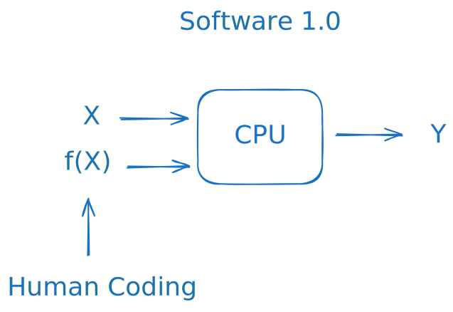
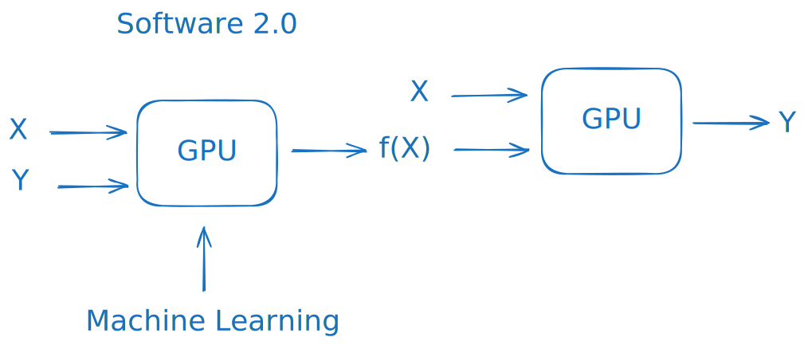
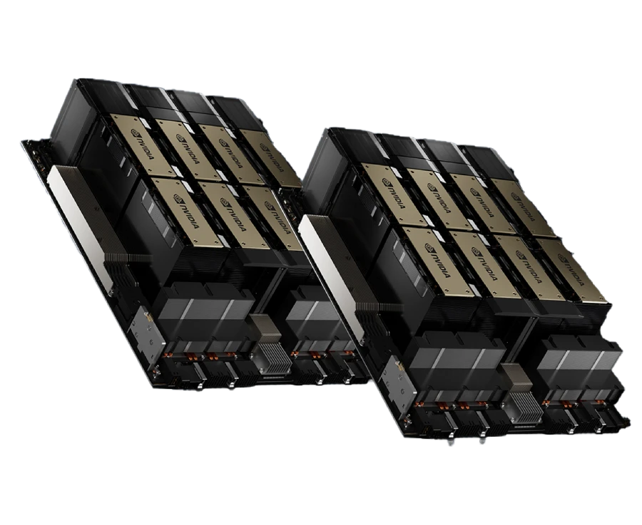
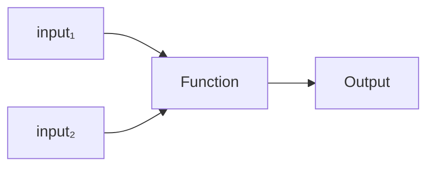
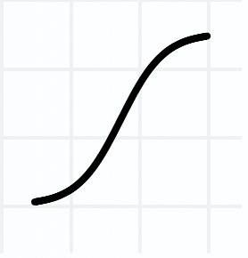
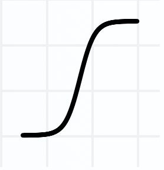
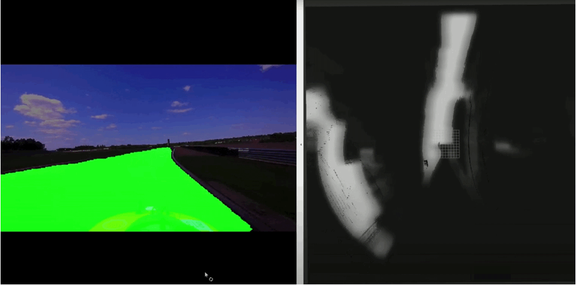

# Mesterséges intelligencia

Artificial Intelligence (AI) and Machine Learning (ML) have taken the world by storm over the past decade. These fields are vast and complex, requiring far more exploration than we can cover within the scope of this class. Therefore, we will focus on capturing the essence of ML, particularly as it relates to computer science and autonomous vehicles.

We’ll begin by examining AI and ML from a problem-solving perspective, followed by a brief overview of the field's current state. Next, we’ll dive into the core concepts of neural networks and explore how these elements work together. Finally, we’ll look at real-world examples of AI applications in autonomous driving.

In our hands-on practice session, we will train a semantic segmentation model ourselves, providing a practical introduction to one of the key techniques in autonomous vehicle perception.

### Problem-Solving Focused Approach

The essence of programming is taking some data and transforming it into the desired output. Building on this thought, problem-solving for a programmer always starts with defining what one wants to achieve with the input data. In other words, what is the desired output. With the advent of machine learning, there are two main approaches to this dilemma:

1. **Traditional Approach**

   In the traditional approach, we **manually define the rules** that determine how data is processed and transformed. This approach has a few distinct characteristics:
   
   - **Explicit Rules**: We explicitly program the steps required to manipulate and analyze data. This requires a deep understanding of the problem so that we can translate our knowledge into precise rules for the program to follow.
   - **Human-Centric Modeling**: The relationship between input and output is modeled based on human intuition and expertise, rather than patterns discovered in data.
   - **Code-Heavy Implementation**: Much of the work involves writing detailed code to handle each aspect of the problem.

The traditional approach depends on human-crafted rules and requires significant manual coding. It is effective for well-defined problems where the rules can be explicitly articulated.

2. **Software 2.0 Approach**

   The machine learning approach shifts the focus from manually defining rules to **teaching an algorithm by example**. Instead of coding specific instructions, we provide data that illustrates the problem, allowing the algorithm to learn the rules indirectly. This approach has several key elements:
   
   - **Learning from Data**: We provide examples to an algorithm, enabling it to identify patterns and relationships within the data. The algorithm then uses these learned patterns to transform data and make predictions or decisions.
   - **Indirect Modeling**: The model (function) that maps input to output is learned from data rather than manually defined. The algorithm constructs this mapping implicitly based on the training examples *(see backpropagation later)*.
   - **Data Preparation**: The work primarily involves gathering and preparing high-quality examples, pre-processing data, and selecting or designing an appropriate learning algorithm.

The machine learning approach relies on data-driven learning, reducing the need for explicitly defined rules. This makes it suitable for complex or variable problems where manually programming every possible scenario would be impractical.

The latter approach is colloquially called **Software 2.0**.

## Overview
**A few key basic concepts worth knowing: (these are just conventions, their usage may vary):**

- Machine learning refers to the adjustment of free parameters in a multivariable (even millions or billions) function (in this case, a model) based on the examples provided in the dataset.
- The structure whose parameters we adjust is called a model (e.g., neural network).
- The process or algorithm used to adjust the model’s parameters is called the learning algorithm.
- The model tuned by the learning algorithm is commonly referred to as a "trained model."

Machine Learning is often categorized by the type of utilized learning algorithm. Below is a brief summary of machine learning techniques:

1. **Supervised Learning**: Trained on labeled data to predict outputs.
   - *Examples*: Classification, Regression.

2. **Unsupervised Learning**: Finds patterns in unlabeled data.
   - *Examples*: Clustering, Dimensionality Reduction.

3. **Reinforcement Learning**: Learns by interacting with an environment and maximizing rewards.
   - *Examples*: Game playing, Robotics.

- **Deep Learning**: Uses deep neural networks to model complex patterns.
   - *Examples*: CNNs for images, RNNs for sequences.

Other notable learning types:
- **Semi-Supervised Learning**: Uses a mix of labeled and unlabeled data.
   - *Example*: Text and image classification with limited labeled data.
- **Self-Supervised Learning**: Generates labels from data structure itself.
   - *Examples*: Language models (e.g., GPT), Image feature learning.
- **Transfer Learning / Fine Tuning**: Adapts a model trained on one task for a related task.
   - *Examples*: Fine-tuning pre-trained image and language models.

AI can also be categorized by the types of inputs (image processing, natural language processing) or by the field where they are utilized (autonomous driving, medical imaging, navigation etc.).

### Generative AI
Generative Models, in a nutshell, identify the patterns and structures within existing data and model the data distribution to generate new samples. Generative AI models use neural networks to generate new and original content.

One of the breakthroughs with generative AI models is the ability to leverage different learning approaches, including unsupervised or semi-supervised learning for training. This has given large tech companies the ability to more easily and quickly leverage a large amount of unlabeled data to create foundation models.
### Transformers
Transformers are the backbone of generative AI. They were introduced in 2017.  
Transformer model revolutionized natural language processing by [replacing recurrent neural networks with self-attention mechanisms](https://www.youtube.com/watch?v=dqoEU9Ac3ek&t=2398s). It vastly improved computational efficiency and enabled the model to capture long-range dependencies in text.
### GPT
GPT is an acronym that stands for "Generative Pre-trained Transformer" and refers to a family of [large language models (LLMs)](https://www.youtube.com/watch?v=wjZofJX0v4M) that can understand and generate text in natural language.

Let's break down the acronym:

- **Generative:** Capable of producing content, such as text and imagery. 
    
- **Pre-trained:** Pre-trained models are networks that have already been taught, using a large data set, to resolve a problem or accomplish a specific task.
    
- **Transformer:** A deep learning architecture that uses [self-attention mechanisms](https://www.youtube.com/watch?v=dqoEU9Ac3ek&t=2398s).

Based on the definitions above, GPT is a **generative** AI technology that has been **previously trained** to **transform** its inputs into a different type of outputs.

### Where To Start Learning AI

If there is generative AI, foundational models, and large language models (LLMs), why learn neural networks?

Understanding neural networks is crucial because they form the backbone of modern AI architectures. Nearly all cutting-edge AI models—whether it's a generative model, a foundational model, or an LLM—are built upon complex neural networks. By learning how neural networks work, you gain insight into the underlying principles of these advanced models, allowing you to grasp how they function and how they can be adapted to specific tasks.

In addition, neural networks are incredibly useful for developing your own applications, especially when building robots or systems that require intelligent behavior. Traditional algorithms often struggle with tasks like image recognition, language understanding, or autonomous navigation, whereas neural networks can excel. By mastering neural networks, you can gather your own data, train models tailored to your needs, and deploy them in your own systems, all independently. This independence and flexibility empower you to create customized AI solutions that outperform traditional approaches.

Training massive models like LLMs and foundational models on your own, however, is prohibitively expensive. These models require substantial computational power, often needing cutting-edge GPUs such as the NVIDIA H100, and in some cases, entire server rooms of high-performance GPUs running for months. For instance, training a state-of-the-art model like LLaMA 3 from scratch would be out of reach for most individuals and even smaller companies due to the extreme resource demands.

However, if you want to dive into LLMs without the need to train them from scratch, you can learn to fine-tune pre-existing models for your specific use cases. Fine-tuning allows you to leverage the knowledge of a large, pre-trained model and adapt it to perform well on your unique data or tasks, providing a practical entry point into working with powerful AI without the prohibitive cost of full-scale training.

## Neural Network Basics
The main focus of this class is neural networks. This part is mainly taken from https://mlu-explain.github.io/neural-networks/, which is an excellent interactive resource, so we use it to learn the basic concepts. Please use the website to get a grasp on the basics. A more print friendly version with minor modifications can be seen below for easier learning.

Neural networks have revolutionized the field of artificial intelligence and are the backbone of popular algorithms today, such as ChatGPT, Stable-Diffusion, and many others. In this introduction, we'll journey through the fundamentals of feed-forward neural networks, starting from their essential components, understanding their learning mechanisms, and even getting hands-on experience by interacting with one ourselves.

Neural networks are networks - that much is clear. _But what is a "network"?_ A network is a structure consisting of interconnected computational nodes, or 'neurons', arranged in layers. These nodes perform mathematical operations on input data, learning some underlying patterns in the data, before producing some output based on those patterns. If this sounds confusing, don't worry, we'll make it clear soon enough.

To build up our intuition, we'll build a basic computational graph into a Neural Network.
## Building Blocks: Computational Graphs
A computational graph has an input node where data is fed into the graph, a function node where the input data is processed (this can contain any type of calculation), and an output node where the result of the computation is produced.  
  
Data flows in one direction, from inputs to output, through the graph.

## Linear Regression
We can represent all sorts of algorithms with computational graphs. For example, we can easily represent [Linear Regression](https://mlu-explain.github.io/linear-regression/) as a computational graph (can be described with the equation of a line, hence the word linear):

$$y = w_0 + w_1 X_1$$
To do so, we need only change two things:
1. Add weights to each edge connecting the input nodes to the function nodes.
2. Update our function node to represent a linear function of a weighted sum:
$$\text{linear} = \sum_{i=1}^{n} w_i X_i$$

With these modifications, we have a computational graph for linear regression. 

The model is outputting predictions along a diagonal line based on the input data. 
As we build up a more complex model for different applications, we will see this linear output change to reflect the state of the corresponding model.

## Perceptrons
Our computational graph setup makes it trivial to model different algorithms. For example, if we want to model a Perceptron instead of logistic regression, we only need to switch our logistic function to a step function:
$$
\text{step} = 
\begin{cases} 
+1, & \text{if } w_i X_i \geq 0 \\ 
-1, & \text{if } w_i X_i < 0 
\end{cases}
$$

In a neural network, this function node we're changing is very special - we call it an artificial neuron.

An artificial neuron is a fundamental computational element that receives inputs, performs a weighted operation on these inputs, and passes the result through a function. In neural networks, these functions _must_ be non-linear, and are referred to as activation functions.

## Neural Networks
Nothing is stopping us from chaining multiple artificial neurons together, feeding one to another. This is all a neural network is!
  
In fact, the original neural networks were called multilayer perceptrons because they were composed of layers of perceptrons (artificial neurons with step functions) feeding one into another! 

*Here is an interesting early attempt to drive with the usage of multilayer perceptrons from 1986:*

<iframe width="560" height="315" src="https://www.youtube.com/embed/ntIczNQKfjQ" title="NavLab 1 (1986) : Carnegie Mellon : Robotics Institute History of Self-Driving Cars" frameborder="0" allow="accelerometer; autoplay; clipboard-write; encrypted-media; gyroscope; picture-in-picture; web-share" referrerpolicy="strict-origin-when-cross-origin" allowfullscreen></iframe>

## Architecture
In general, a neural network architecture consists of three layer types: 
- input layer: A layer with a node for each network input. 
- hidden layer(s): A layer full of artificial neurons.
- output layer: A layer representing the network's output.

There should only be one input and one output layer, but there may be an arbitrary number of hidden layers.

Designing a neural network architecture is more of an art than a science. The input and output layer will be selected for the specific problem, but the hidden layer is fairly arbitrary.   
  
Neural networks can be wide: having many neurons in a given hidden layer, or deep: having many hidden layers in the network. [Balancing neuron count](https://mlu-explain.github.io/bias-variance/) optimizes performance; more neurons enable complex learning, at the cost of the risk of overfitting and more computational cost.

As you can see, neural networks are not so complicated! They are just computational graphs, channeling inputs through successive layers of computation to generate outputs. This process of inference, whereby inputs are fed through the network to produce output predictions, is called the forward pass. Let's talk more about those layers of computation, the activation functions.

## Activation Functions
Activation functions are at the heart of artificial neurons in a neural network. These crucial components **introduce non-linearity into the model**, transforming the weighted inputs to generate an output. 

**Simply put, an activation function decides how much signal to pass onto the next layer based on the input it receives. The core idea is that this passing does not have to be linear. This is how non-linearity is introduced.** 
This idea of chaining many weighted signals together is what allows neural networks to learn very complex relationships.
  
The non-linear nature of these functions is essential for neural networks to learn from complex data. If we only used linear activation functions, no matter how many layers we stacked, the network would behave just like a single-layer perceptron because the composition of linear functions is still a linear function. This limits the complexity of tasks the network can learn. Non-linear activation functions, on the other hand, enable the network to learn complex patterns and solve intricate problems by adding layers of abstraction.  

There's a diverse range of activation functions utilized in neural networks, each with its unique benefits and applications. Here are four popular activation functions:

| Name                        | Plot              | Function                                                  | Description                                    |
|-----------------------------|-------------------|-----------------------------------------------------------|------------------------------------------------|
| Sigmoid (logistic)          |  | $f(x) = \frac{1}{1 + e^{-x}}$                          | Squashes input to (0, 1).                      |
| Hyperbolic Tangent (tanh)   |      | $f(x) = \frac{e^x - e^{-x}}{e^x + e^{-x}}$             | Squashes input to (-1, 1).                     |
| Rectified Linear Unit (ReLU) |      | $f(x) = \begin{cases} 0, & x < 0 \\ x, & x \geq 0 \end{cases}$ | Only keeps positive values.                    |
| Step Function (Perceptron)  |      | $f(x) = \begin{cases} +1, & x \geq 0 \\ -1, & x < 0 \end{cases}$ | Returns only -1 or 1 (neuron fires or doesn't fire). |

The sigmoid (or logistic) function, which ranges from 0 to 1, is particularly useful in the output layer of binary classification models, representing the probability of a binary event. However, it can suffer from the vanishing gradients problem during backpropagation.  
  
The hyperbolic tangent (or 'tanh') function, which ranges from -1 to 1, provides a zero-centered output designed to make learning for the next layer easier. Yet, like sigmoid, it also faces the vanishing gradients issue.   
  
The Rectified Linear Unit (or 'ReLU') function is a popular choice in hidden layers due to its efficiency. It activates a node if its input is positive, otherwise, it outputs zero. This simplicity reduces computational cost and mitigates the vanishing gradients problem, but it can lead to dead neurons where some neurons never activate.
  
Despite their simplicity, chaining these functions together in a neural network can have magical results. That said, it's crucial to remember that there's no one-size-fits-all solution when it comes to choosing activation functions. The best choice often depends on the specific characteristics of the problem at hand, the nature of the input and output data, and the architecture of the network. Thus, understanding these functions and their implications is key to building effective and efficient neural networks.

## Backpropagation: How Networks Learn
Now that we've grasped the concept of activation functions and their role in neural networks, it's time to understand how these networks learn. The magic behind this learning process is a technique known as backpropagation.  
  
Backpropagation is an algorithm used during the training of neural networks. The goal of backpropagation is to update the weights so that the Neural Network makes better predictions. Specifically, backpropagation will calculate the gradient of the loss function with respect to the weights of the network, updating the weights layer-by-layer to minimize the network's prediction error.  

To make the process as clear as possible, let's go step-by-step.

### Forward Pass
During the forward pass, input data is fed through a neural network's layers to produce a prediction. This process involves calculating the weighted sums and applying activation functions for each neuron in each layer.  
### Error
The error, also known as loss, measures the difference between the neural network's predicted output and the actual target values. By minimizing this error, the neural network learns to improve its predictions during training.  

**The goal of backpropagation is to update the model's weights so that it learns to predict with less error.**
### Backward Pass
In the backward pass, the error is propagated back through the network, starting from the output layer, to adjust the weights and biases of each neuron. This weight adjustment process, guided by the gradients of the error with respect to the weights, aims to minimize the overall error of the network. (This process uses the Chain Rule from calculus to update the weights layer-by-layer, but we won't go into detail here.)
### Backpropagation

**Predictions flow forward through the network in the forward pass, and errors flow backwards through the network, adjusting weights along the way. This process is know as Backpropagation.**  
  
Backpropagation is a supervised learning algorithm used in neural networks that optimizes their weights and biases through iterative forward and backward passes. By computing the gradients of the error with respect to the weights, backpropagation enables the network to learn and improve its predictions.

Backpropagation doesn't occur just once! For a typical neural network, backpropagation is repeated hundreds, if not thousands, of times. To keep things simple, we animate only a couple more runs of backprop here.  
  
The key thing to note is that, at each run, the network's weights are updated in a manner that improves our model's performance!

We just went over backpropagation, the process by which Neural Networks try to find the optimal weights for the given prediction task (optimal here meaning the weights that result in the lowest error value).  
  
It's important to note that this process is not perfect! Many issues may occur when training a neural network, even a network as simple as above.
## Going Forward: Other Neural Network Architectures
Up to this point, we've described a specific neural network architecture where values flow forward linearly through a network, and gradients flow linearly backwards through a network. These are often referred to as feed forward neural networks, or artificial neural networks (ANN's). You may even see them referred to as Multilayer Perceptrons, a callback to the early Neural Network compositions of Perceptrons.

However, this is just the tip of the iceberg when it comes to the field of neural networks. While feed forward neural networks have been incredibly successful in a wide range of applications, many other types of neural network architectures exist that can be used to solve different types of problems. To get you started on your journey into the world of neural network's, and to up your buzzword game in today's world of AI obsession, the most popular architectures are listed and briefly explained below.

**Recurrent Neural Networks (RNNs):** Recurrent Neural Networks (RNNs) differ from feed-forward neural networks as they have a built-in memory, allowing them to process sequences of data. This makes RNNs well-suited for tasks like natural language processing and time series prediction. They can learn patterns in sequences by connecting the output from one time step to the input of the next, remembering previous information (the _recurrence_ in the namesake).

**Convolutional Neural Networks (CNNs):** Convolutional Neural Networks (CNNs) are specifically designed for processing spatial data, such as images. Unlike feed-forward networks, CNNs use special convolutional layers to scan and identify local patterns within the input. Imagine a grid sliding across an image, identifying patterns. This makes them more efficient for image recognition, object detection, and other computer vision tasks, where spatial information is crucial. They are also used for sequential tasks, such as time-series applications.

**Generative Adversarial Networks (GANs):** Generative Adversarial Networks (GANs) consist of two distinct neural networks, a generator and a discriminator, that compete against each other. The generator tries to create a data sample, and the discriminator tries to determine if that data sample came from the training data or the generator. By optimizing against each other, GANs learn to generate new data samples by capturing the distribution of the training data. They are widely used for tasks such as image synthesis, style transfer, and data augmentation.

**Graph Neural Networks:** Graph Neural Networks are a type of neural network that operate on graph-structured data, which is not easily handled by feed-forward networks. They are designed to learn and encode the relationships between nodes in a graph, making them useful for tasks such as social network analysis, molecular property prediction, and recommendation systems.

**Transformer Architectures:** Transformer architectures differ from feed-forward networks as they rely on a self-attention mechanism to process input data, allowing them to handle long-range dependencies more effectively. These models are massive, and actually incorporate feed forward neural networks in parts of their architecture. They have been especially successful in natural language processing tasks, such as machine translation and text summarization, due to their ability to capture contextual information across large sequences. Most of the currently hyped AI models, such as the GPT family, are variants of transformers.

This is not an exhaustive list of network architectures. Rather, these are high-level architectures with many variants - more are developed every day! But it's a great starting point to send you forward on your journey into neural networks and deep learning.

## AI in Autonomous Driving

<iframe width="560" height="315" src="https://www.youtube.com/embed/NZZIPcBBAc8?rel=0" title="YouTube video player" frameborder="0" allow="accelerometer; autoplay; clipboard-write; encrypted-media; gyroscope; picture-in-picture" allowfullscreen></iframe>

<iframe width="560" height="315" src="https://www.youtube.com/embed/mTcrA6HYsMM?rel=0" title="YouTube video player" frameborder="0" allow="accelerometer; autoplay; clipboard-write; encrypted-media; gyroscope; picture-in-picture" allowfullscreen></iframe>

<iframe width="560" height="315" src="https://www.youtube.com/embed/lajDCnVG7vQ" title="Tesla AI FINALLY drives on Highways (First Impressions)" frameborder="0" allow="accelerometer; autoplay; clipboard-write; encrypted-media; gyroscope; picture-in-picture; web-share" referrerpolicy="strict-origin-when-cross-origin" allowfullscreen></iframe>