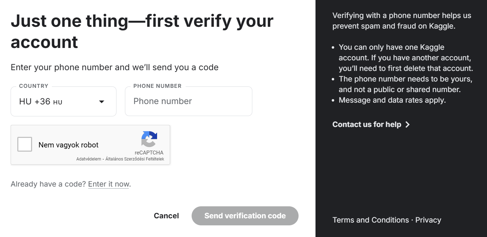

# Kaggle Notebook - Előkészítés (gyakorlat)

A közös gyakorlati munkához szükségünk lesz nagyobb GPU számítási kapacitásra, mint ami a gépteremben elérhető.
A `kaggle.com` weboldal ezt lehetővé teszi számunkra a [Kaggle Notebooks](https://www.kaggle.com/code)-on keresztül.

A gyakorlati munka előkészítéséhez kérlek kövesd az alábbi lépéseket:

#### Regisztráció
Menj a [kaggle.com](https://www.kaggle.com/code) weboldalra és a jobb felső sarokban kattints a `Register` gombra, majd végezd el a regisztrációt. Amennyiben már rendelkezel felhasználói fiókkal, lépj be és folytasd ugyanúgy a telefonos verifikációval.

#### Telefonos Verifikáció
Erre a lépésre azért van szükség, hogy a limitált GPU erőforrásokat egy felhasználó csak egy fiókon keresztül tudja használni. Ennek megoldásaként a telefonszám összekapcsolásra kerül a fiókkal. Ezt a továbbiakban megszüntetheted ha szeretnéd (a gyakorlati órát követően).

- Miután beléptél a fiókodba, kattints a `Profile` gombra (jobb felső sarok), majd `Settings` -> `Phone verification` (kattints a `Phone Verify` gombra).

- Kövesd az utasításokat, hogy megerősítsd a fiókodat.

Amennyiben ezt megtetted, a fiókod készen áll a gyakorlati órára.

*Az ablak, ahol a megerősítés  történik:*

