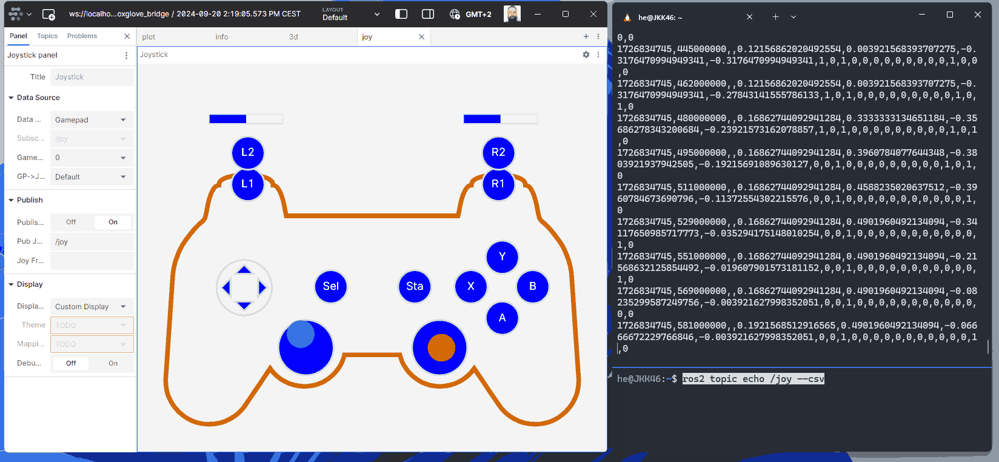

# Joystick bevezetés

Todo

## Joystick  WSL alatt

Töltsük le a `foxe` extension-t Foxglove Studio-hoz, majd drag and drop módszerrel húzzuk bele a `foxglove-joystick` csomagot.

Letölthető a [github.com/joshnewans/foxglove-joystick/releases](https://github.com/joshnewans/foxglove-joystick/releases) GitHub oldalról.


```powershell
ros2 topic echo /joy --csv
```



## Josytick Linux alatt

```bash
$ lsusb
Bus 001 Device 004: ID 046d:c219 Logitech, Inc. Cordless RumblePad 2
$ ls -l /dev/input/js0 
$ sudo chmod a+rw /dev/input/js0
```

```bash
ros2 topic echo /joy
```

## ROS 2 joy package


=== "Humble"

    ```bash
    sudo apt install ros-humble-joy
    ```

=== "Jazzy"

    ```bash
    sudo apt install ros-jazzy-joy
    ```

=== "Általános"

    ```bash
    sudo apt install ros-$ROS_DISTRO-joy
    ```