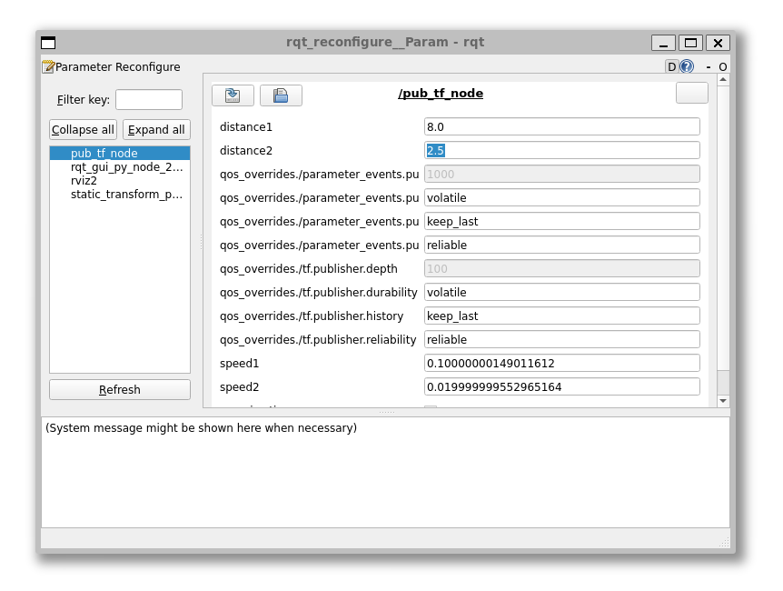

## ROS 2 haladó funkciók

## Ellenőrző kérdések

- Melyik ROS verziót használjuk a félévben? 
- Mi a node?
- Mi a topic?
- Milyen típusú adatokat küldhetünk a topicokon keresztül? (példák)

## ROS 2 launch fájlok

### `ROS 2` launch szemléltetés


*Forrás:* [foxglove.dev](https://foxglove.dev/blog/how-to-use-ros2-launch-files)

### `ROS 2` launch fájlok

Több ROS 2 node futtatása sok időt vesz igénybe és több terminálablakra van szükség. Még a kisebb projektek vagy robotok is egyszerre több node-ot futtathatnak.

Képzeljünk el egy robotot, amely a "érzékel-gondolkodik-cselekszik" (sense-think-act) modell alapján működik, és minden lépéshez külön node-ot futtat. Egy `sensor_node` felelős az érzékelő adatainak olvasásáért, egy `compute_node` fogadja ezeket az adatokat, és parancsot küld a kerekeknek, végül pedig egy `motor_node` fogadja a parancsot, és a szükséges feszültséget adja a motoroknak.

Ahelyett, hogy minden egyes node-ot külön terminálablakban futtatnánk minden alkalommal, amikor elindítjuk a robotot, használhatunk egy indítófájlt, hogy mindezeket egyszerre futtassuk – egyetlen parancs segítségével, egyetlen terminálablakban.

### Hogyan tehetjük ezt meg?

Három lehetőségünk van launch fájlt írni, pythonban, yaml-ben vagy xml-ben. Ebből kettőt bemutatunk: az xml fájlok egyszerűbbek, de a python fájlok sokkal rugalmasabbak és könnyebben kezelhetőek.

=== "Python"

    ``` py linenums="1"
    # This function is always needed
    def generate_launch_description():

    # Declare a variable Node for each node
    compute_node = Node(
        package="launch_pkg",
        executable="compute_node"
    )
    sensor_node = Node(
        package="launch_pkg",
        executable="sensor_node"
    )
    motor_node = Node(
        package="launch_pkg",
        executable="motor_node"
    )
    ```

=== "XML"
    
    ``` xml linenums="1"
    <launch>
        <node pkg="launch_pkg" type="sensor_node" name="sensor_node" output="screen"/>
        <node 
            pkg="launch_pkg" 
            type="compute_node" 
            name="compute_node" 
            output="screen"/>
        <node 
            pkg="launch_pkg" 
            type="motor_node" 
            name="motor_node" 
            output="screen"/>
    </launch>
    ```


## Namespace

Az launch fájlok csoportokba vagy névterekbe is csoportosíthatják a node-okat. Ez megkönnyíti a node-ok viselkedésének nyomon követését és figyelemmel kísérését.

Egy node-nak csak egy neve van, de a névterek több szintjéhez is tartozhat. Ezeket a névtereket perjellel (`/`) lehet összekapcsolni – minden névtér nélküli csomópontban mindig egyetlen `/` szerepel a neve előtt (pl. `/sensor_node`). A deklaráció során megadott névtér nélküli témakörök öröklik a csomópont névterét, ahogy az az előző ábrán is látható.

Adjuk hozzá három node-ot a `sense_think_act` névteréhez:

```py
sensor_node = Node(
  namespace="sense_think_act",
  package="launch_pkg",
  executable="sensor_node"
)

compute_node = Node(
  namespace="sense_think_act",
  package="launch_pkg",
  executable="compute_node"
)

motor_node = Node(
  namespace="sense_think_act",
  package="launch_pkg",
  executable="motor_node"
)
```


*Megjegyzés:* A balról jobbra elrendezés helyett a helykihasználás miatt most a fentről lefelé elrendezést használtunk.


### Más package-ből származó node-ok, paraméterek

```py
robot_node = Node(
  namespace="core",
  package="params_pkg",
  executable="robot_node",
  parameters=[{
    "robot_name":"RobotA",
    "max_speed":4.2,
    "waypoints":["Home", "Room 1", "Corridor", "Home"]
  }]
)
foxglove_bridge = Node(
    package='foxglove_bridge',
    executable='foxglove_bridge',
    parameters=[{
        'port': 8765,
        },
    ]
)

ld = [compute_node,
    foxglove_bridge,
    sensor_node,
    motor_node,
    robot_node]
```


### További példa

- `robot_a` namespace:
    - `sensor_node_a`: Érzékelő adatokat publikál a `/robot_a/sensor_data` topicra.
    - `control_node_a`: Feliratkozik a `/robot_a/sensor_data` topicra, és parancsokat küld a `/robot_a/cmd_vel` topicra.
    - `motor_node_a`: Feliratkozik a `/robot_a/cmd_vel` topicra, hogy fogadja a motor parancsokat.
- `robot_b` namespace:
    - `sensor_node_b`: Érzékelő adatokat publikál a `/robot_b/sensor_data` topicra.
    - `control_node_b`: Feliratkozik a `/robot_b/sensor_data` topicra, és parancsokat küld a /robot_b/cmd_vel topicra.
    - `motor_node_b`: Feliratkozik a `/robot_b/cmd_vel` topicra, hogy fogadja a motor parancsokat.
- Megosztott:
    - Mindkét robot megoszt egy topicot, a` /shared/environment_data`-t, ahol a `sensor_node_a` és a `sensor_node_b` is publikálhat vagy feliratkozhat.
    - Mindkét robot megoszt egy topicot, a `/shared/map_data`-t, ahol a `map_server` publikál és a `sensor_node_a` és a `sensor_node_b` feliratkozhat.


### Videó

<iframe width="560" height="315" src="https://www.youtube.com/embed/PqNGvmE2Pv4?si=-pLNSZsHNDE5br5I" title="YouTube video player" frameborder="0" allow="accelerometer; autoplay; clipboard-write; encrypted-media; gyroscope; picture-in-picture; web-share" referrerpolicy="strict-origin-when-cross-origin" allowfullscreen></iframe>

## Vizualizáció és debug

### Foxglove Studio / Lichtblick Suite

A Foxglove Studio egy nyílt forráskódú, robotikai adatokat vizualizáló és hibakereső eszköz. Létezik `Windows`, `Linux` és `MacOS` rendszerekre. A `v1.87.0`-ig bezárólag nyílt forráskódu volt, a `v2.0.0`-tól pedig ingyenesen használható, de zárt forráskódú. Az open source fejlesztést több fork, például a **Lichtblick Suite** vette át. Elérhető számos módon:

- önálló asztali alkalmazásként futtatható
- böngészőben hozzáférhető
- saját domainen, önállóan hostolható

A natív robotikai eszközök (mint például az ROS ökoszisztéma részei) általában csak Linux rendszeren támogatottak, de a Studio asztali alkalmazás Linuxon, Windows-on és macOS-en is működik. Akár az ROS stack más operációs rendszeren fut, a Studio képes kommunikálni a robottal zökkenőmentesen.


A Studio gazdag vizuális elemeket és hibakereső panelokat kínál - interaktív diagramoktól, 3D vizuális elemekig, kameraképektől, és diagnosztikai adatfolyamokig. Legyen szó valós idejű robotkövetésről, vagy `.bag` / `.mcap` fájlban történő hibakeresésről, ezek a panelok segítenek a különböző, általános robotikai feladatok megoldásában.

Ezek a panelok ezután egyedi elrendezésekben konfigurálhatók és összeállíthatók a projekt egyedi igényeinek és munkafolyamatainak megfelelően.


- [Foxglove Studio letöltés](https://foxglove.dev/download)
- [Lichtblick Suite letöltés](https://github.com/Lichtblick-Suite/lichtblick/releases)

<video width="100%" loop="" autoplay="" muted="" playsinline="" poster="https://cdn.prod.website-files.com/66a36245725199d12625c1d5/66dc638d81bf97e670aaf5fc_website-product-hero.webp">
  <source src="https://storage.googleapis.com/assets.foxglove.dev/website/website-product-hero.webm" type="video/mp4">
</video>

### Rviz

Az `Rviz2` a `ROS 2` natív, nyílt forráskódú, robotikai adatokat vizualizáló és hibakereső eszköze. Ennek értelmében leginkább Linux rendszeren használható, de a Windows és macOS támogatás is folyamatosan fejlődik.


```bash
ros2 run rviz2 rviz2
```


```bash
ros2 run rviz2 rviz2 --help
```
Parancs segítségével megtudhatjuk, hogy pl. `-d` kapcsolóval betölthetünk egy `.rviz` konfigurációs fájlt, vagy `-f` fix frame-et adhatunk meg.


Bővebben: [docs.ros.org/en/humble/Tutorials/Intermediate/RViz/RViz-User-Guide/RViz-User-Guide.html](https://docs.ros.org/en/humble/Tutorials/Intermediate/RViz/RViz-User-Guide/RViz-User-Guide.html)

### rqt_graph

Az `rqt_graph` a node-ok és topic-ok vizualizációjára használható.

```bash
ros2 run rqt_graph rqt_graph
```


### rqt_console

Az `rqt_console` log (info, debug, warn, error, fatal) üzenetek megjelenítésre, szűrésére és elemzésére használható.

```bash
ros2 run rqt_console rqt_console
```


### rqt_tf_tree

Az `rqt_tf_tree` a transzformációk vizualizációjára használható.

```bash
ros2 run rqt_tf_tree rqt_tf_tree
```


### rqt_reconfigure

Az `rqt_reconfigure` a node-ok paramétereinek módosítására használható.

```bash
ros2 run rqt_reconfigure rqt_reconfigure
```




## Források
- [foxglove.dev/blog/how-to-use-ros2-launch-files](https://foxglove.dev/blog/how-to-use-ros2-launch-files)
- [youtube.com/watch?v=PqNGvmE2Pv4&t](https://www.youtube.com/watch?v=PqNGvmE2Pv4&t) 
- [docs.ros.org/en/humble/Tutorials/Intermediate/Launch/Creating-Launch-Files.html](https://docs.ros.org/en/humble/Tutorials/Intermediate/Launch/Creating-Launch-Files.html)
- [docs.ros.org/en/humble/Tutorials/Beginner-Client-Libraries/Creating-Your-First-ROS2-Package.html](https://docs.ros.org/en/humble/Tutorials/Beginner-Client-Libraries/Creating-Your-First-ROS2-Package.html)
- [docs.ros.org/en/humble/Tutorials/Beginner-Client-Libraries/Writing-A-Simple-Cpp-Publisher-And-Subscriber.html](https://docs.ros.org/en/humble/Tutorials/Beginner-Client-Libraries/Writing-A-Simple-Cpp-Publisher-And-Subscriber.html)
- [docs.ros.org/en/humble/Tutorials/Beginner-Client-Libraries/Writing-A-Simple-Py-Publisher-And-Subscriber.html](https://docs.ros.org/en/humble/Tutorials/Beginner-Client-Libraries/Writing-A-Simple-Py-Publisher-And-Subscriber.html)
- [docs.ros.org/en/humble/Tutorials/Intermediate/RViz/RViz-User-Guide/RViz-User-Guide.html](https://docs.ros.org/en/humble/Tutorials/Intermediate/RViz/RViz-User-Guide/RViz-User-Guide.html)