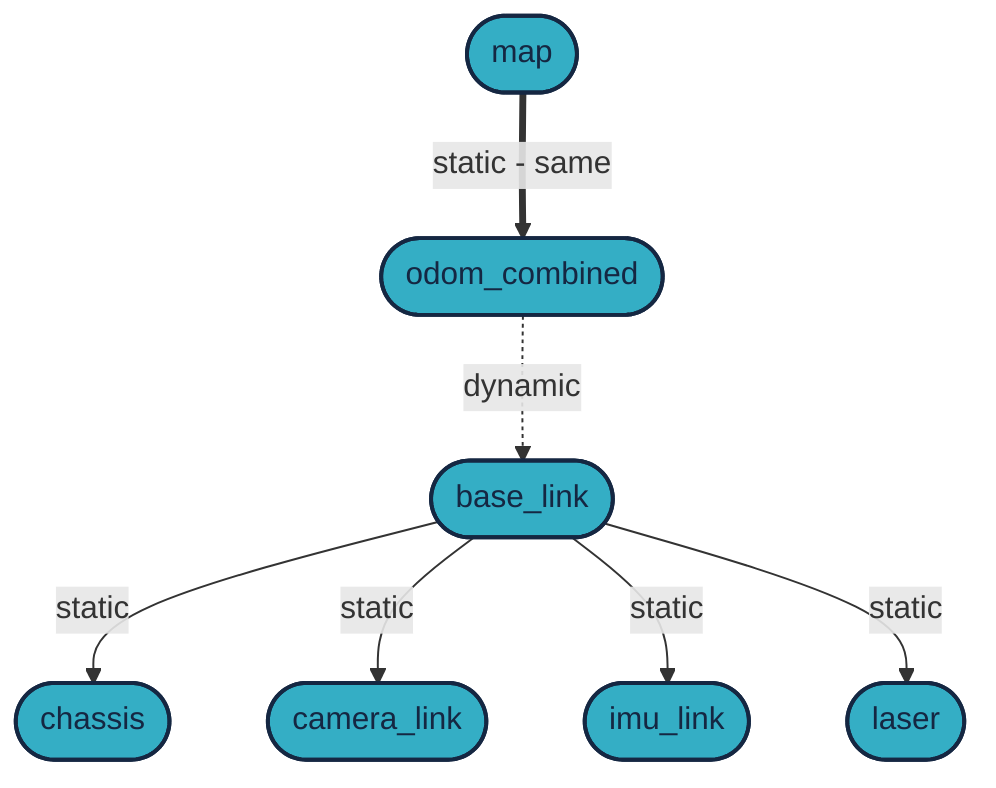

# `ROS 2` Roboracer (korábbi nevén F1/10) és Wheeltec Roboworks Gazebo szimuláció

A szimuláció ROS 2 kompatibilis: [](https://docs.ros.org/en/humble/)

## Videó

A workshophoz tartozó videósorozat 1. része elérhető a YouTube-on:

<iframe width="560" height="315" src="https://www.youtube.com/embed/90cVRC2Hd7Y?si=GUiIyuXk71Bu1uGd" title="YouTube video player" frameborder="0" allow="accelerometer; autoplay; clipboard-write; encrypted-media; gyroscope; picture-in-picture; web-share" referrerpolicy="strict-origin-when-cross-origin" allowfullscreen></iframe>

A videó 2. része:

<iframe width="560" height="315" src="https://www.youtube.com/embed/ZlNOnPJfS9c?si=Cj6xaboiXv5sCHvL" title="YouTube video player" frameborder="0" allow="accelerometer; autoplay; clipboard-write; encrypted-media; gyroscope; picture-in-picture; web-share" referrerpolicy="strict-origin-when-cross-origin" allowfullscreen></iframe>

## Előfeltételek (áttekintés)

1. **ROS 2 Humble:** 🟠 lásd korábbi órákat vagy [docs.ros.org/en/humble/Installation.html](https://docs.ros.org/en/humble/Installation.html)  
2. **Gazebo Fortress:** 🟠 lásd korábbi órákat [gazebosim.org/docs/fortress/install_ubuntu](https://gazebosim.org/docs/fortress/install_ubuntu)  
3. **`ROS gz bridge`:** 🟠 lásd korábbi órákat, de a telepítés egyetlen paranccsal megtehető:  
   `sudo apt install ros-humble-ros-gz-bridge`, [gazebosim.org/docs/fortress/ros2_integration](https://gazebosim.org/docs/fortress/ros2_integration)  
4. **Egyedi világok és modellek építése, futtatása** ✅ aktuális tananyag 

<figure markdown="span">
  { width="80%" }
  <figcaption>Official F1/10 vehicle vs Wheeltec Roboworks Ackermann Rosbot mini vehicle</figcaption>
</figure>


## Megjegyzés beállítások WSL2-höz

Van egy [ismert probléma](https://github.com/gazebosim/gz-sim/issues/1841), amit így lehet orvosolni:

```bash
export LIBGL_ALWAYS_SOFTWARE=1
echo "export LIBGL_ALWAYS_SOFTWARE=1" >> ~/.bashrc
source ~/.bashrc
```

## Opcionális: `rviz-2d-overlay` plugin telepítése

```bash
sudo apt install ros-humble-rviz-2d-overlay*
```


## Telepítés ellenőrzése

!!! success 

    Ellenőrizzük, hogy az `ign gazebo` és a `ros2` parancsok működnek.


Legalább egyik parancsot próbáljuk ki, pl:

```bash
ign gazebo
```

```bash
ign gazebo -v 4 -r ackermann_steering.sdf
```

```bash
ign gazebo shapes.sdf
```

```bash
ign param --versions
```


## Csomagok és buildelés

Detailed description of the packages and build process.

It is assumed that the workspace is `~/ros2_ws/`.


``` bash
cd ~/ros2_ws/src
```

``` bash
git clone https://github.com/robotverseny/robotverseny_gazebo24
```

``` bash
git clone https://github.com/robotverseny/megoldas_sim24
```

### Build

``` bash
cd ~/ros2_ws
```

``` bash
colcon build --symlink-install --packages-select robotverseny_application robotverseny_description robotverseny_bringup robotverseny_gazebo megoldas_sim24
```

Opcionális, de érdemes feltenni az RViz 2D Overlay csomagot, amivel a debug szövegeket lehet megjeleníteni a RViz2-ben:

``` bash
sudo apt install ros-humble-rviz-2d-overlay*
```

## Szimuláció futtatása

<details>
<summary> Don't forget to source before ROS commands.</summary>

``` bash
source ~/ros2_ws/install/setup.bash
```
</details>

``` bash
ros2 launch robotverseny_bringup roboworks.launch.py
```

## Vezérlők futtatása

```bash
ros2 run megoldas_sim24 simple_pursuit.py
ros2 run megoldas_sim24 follow_the_gap.py
```


## Hasznos parancsok

Publish command topic:
``` bash
ros2 topic pub --once /roboworks/cmd_vel geometry_msgs/msg/Twist "{linear: {x: 2.5, y: 0.0, z: 0.0}, angular: {x: 0.0, y: 0.0, z: -0.01}}"
```

Teleop twist keyboard:
``` bash
ros2 run teleop_twist_keyboard teleop_twist_keyboard --ros-args -r /cmd_vel:=/roboworks/cmd_vel
```
    
Ignition info topic:
``` bash
ign topic -i --topic /model/roboworks/cmd_vel
```
Ignition echo topic:

``` bash
ign topic -et /model/roboworks/cmd_vel
```

Topics:

``` bash
ros2 topic list
```
<details>
<summary> Here are the topics.</summary>

``` bash
/clicked_point
/clock
/goal_pose
/initialpose
/joint_states
/parameter_events
/robot_description
/roboworks/cmd_vel
/roboworks/odometry
/roboworks/scan
/rosout
/tf
/tf_static
```
</details>

## Transzformációk

The frame `/odom_combined` is practically the same as `/map`, there is a static `0,0,0` transform between them. The only dynamic transform is between `/odom_combined` and `/base_link`.



You can visualize the frames with:

``` bash
ros2 run rqt_tf_tree rqt_tf_tree
```

!!! danger


## Teljesítmény-problémák megoldása

If the simulation is slow, try the following:

Add `--cmake-args -DCMAKE_BUILD_TYPE=Release` to the build command. And or adjust `--parallel-workers N` to the number of CPU cores. Example: 

``` bash
colcon build --symlink-install --cmake-args -DCMAKE_BUILD_TYPE=Release --parallel-workers 4 --packages-select robotverseny_application robotverseny_description robotverseny_bringup robotverseny_gazebo megoldas_sim24
```

As suggested by [DDS settings for ROS 2 and Autoware](https://autowarefoundation.github.io/autoware-documentation/main/installation/additional-settings-for-developers/network-configuration/dds-settings/): set the config file path and enlarge the Linux kernel maximum buffer size.

``` bash
# Increase the maximum receive buffer size for network packets
sudo sysctl -w net.core.rmem_max=2147483647  # 2 GiB, default is 208 KiB

# IP fragmentation settings
sudo sysctl -w net.ipv4.ipfrag_time=3  # in seconds, default is 30 s
sudo sysctl -w net.ipv4.ipfrag_high_thresh=134217728  # 128 MiB
```

To make it permanent,

``` bash
sudo nano /etc/sysctl.d/10-cyclone-max.conf
```

Paste the following into the file:
``` bash
# Increase the maximum receive buffer size for network packets
net.core.rmem_max=2147483647  # 2 GiB, default is 208 KiB

# IP fragmentation settings
net.ipv4.ipfrag_time=3  # in seconds, default is 30 s
net.ipv4.ipfrag_high_thresh=134217728  # 128 MiB, default is 256 KiB
```
Save and exit (`CTRL+O`, `ENTER`, `CTRL+X`).

Also have a look at [Network settings for ROS 2 and Autoware](https://autowarefoundation.github.io/autoware-documentation/main/installation/additional-settings-for-developers/network-configuration/) and [Performance Troubleshooting](https://autowarefoundation.github.io/autoware-documentation/main/support/troubleshooting/performance-troubleshooting/)

## Linkek

- [Angol nyelvű leírás](https://jkk-research.github.io/workshops/f1tenth_sim_a/)
- [robotverseny.github.io](https://robotverseny.github.io/)
- [Gazebo Fortress](https://gazebosim.org/docs/fortress/install_ubuntu)
- [github.com/robotverseny](https://github.com/robotverseny)
- [robotverseny_gazebo24](https://github.com/robotverseny/robotverseny_gazebo24)
- [megoldas_sim24](https://github.com/robotverseny/megoldas_sim24)
- [robotverseny.github.io](https://robotverseny.github.io)
- [jkk-research.github.io/workshops/f1tenth_sim_a/](https://jkk-research.github.io/workshops/f1tenth_sim_a/)