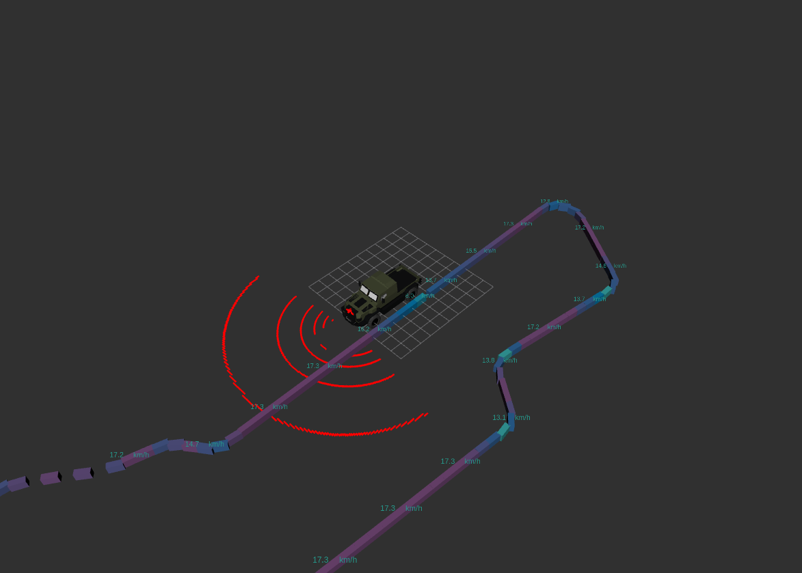
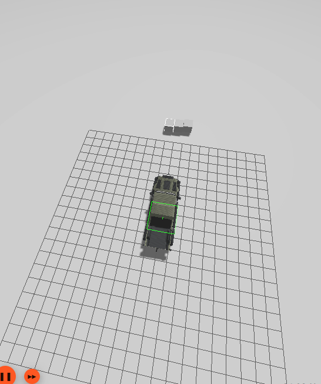
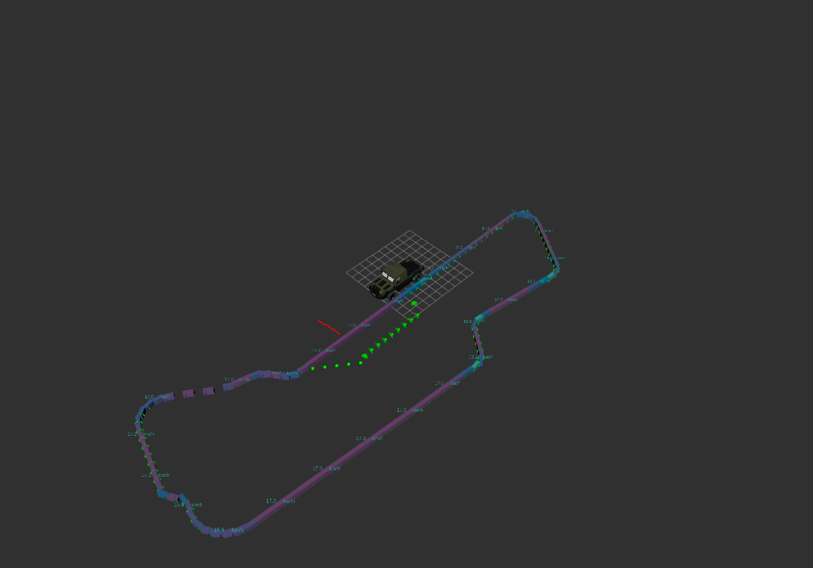

 


# `1.` feladat

Ebben a feladatban az elméleti órán bemutatott polinom alapú lokális tervező megvalósítását fogjuk bemutatni.
Ehhez elsőként frissítsük az arj_packages repository-t!

## Clone és build

``` r
cd ~/ros2_ws/src/arj_packages/
``` 
``` r
git pull
```
Ezek után buildeljük az arj_local_planner nevű package-t!

``` r
cd ~/ros2_ws
``` 
``` r
colcon build --packages-select arj_local_planner
```
## Futtatás

Ezek után futtassuk a planner-t a launch fájl segítségével, source-olás után.

``` r
source ~/ros2_ws/install/setup.bash
``` 
``` r
ros2 launch arj_local_planner run_all.launch.py
```

Nézzük meg, milyen topicok jöttek létre (új terminálban)!

``` r
ros2 topic list
```

Létrejött a /goal_pose topic illetve a /planner/trajectory topic. A goal_pose az a célpozíció, amelyre a tervező tervez, a planner/trajectory pedig a waypoint list, maga a tervezett trajektória.
Indítsünk egy rviz-t!

``` r
ros2 run rviz2 rviz2
```

Válasszuk ki a map frame-t, illetve adjuk hozzá a /planner/trajectory topicot. Ezek után a fenti sávból a 2D Goal Pose opciót használva vegyünk fel egy goal pose-t a griden úgy, hogy az a pozitív koordináták irányában helyezkedjen el! Ekkor a tervező automatikusan ráilleszt egy polinomot a célpozícióra.


Ezt az egyszerű tervezőt használhatjuk pl. mozgó célpontra (másik jármű, sáv közepe, globális trajektória egy pontja...stb) illetve statikus célpontra (pl. parkolóhely).


# `2.` feladat

Az akadály elkerülési algoritmus bemutatása szimuláció segítségével

Ellenőrizük, hogy megvannak-e a következő packagek, ha nincsenek klónozuk le őket a workspacebe. Amenyiben megvannak a git pull parancsal frissítsük őket:
 - **wayp_plan_tools :** 
``` r
cd ~/ros2_ws/src
git clone https://github.com/jkk-research/wayp_plan_tools.git
``` 
vagy
``` r
cd ~/ros2_ws/src/wayp_plan_tools
git pull
``` 
- **sim_wayp_plan_tools**
``` r
cd ~/ros2_ws/src
git clone https://github.com/jkk-research/sim_wayp_plan_tools.git
``` 
vagy
``` r
cd ~/ros2_ws/src/sim_wayp_plan_tools
git pull
```
- **arj_packages**
``` r
cd ~/ros2_ws/src
git clone https://github.com/sze-info/arj_packages.git
``` 
vagy
``` r
cd ~/ros2_ws/src/arj_packages
git pull
``` 

- **lidar_cluster_ros2**
``` r
cd ~/ros2_ws/src
git clone https://github.com/jkk-research/lidar_cluster_ros2.git
``` 
vagy
``` r
cd ~/ros2_ws/src/lidar_cluster_ros2
git pull
``` 
## branch váltás és buildelés

A szimuláció indításhoz a két packeges-ben váltsunk branchet és buildeljük a workspaceünket
``` r
cd ~/ros2_ws/src/sim_wayp_plan_tools
```
``` r
git checkout gamma
```
``` r
cd ~/ros2_ws/src/wayp_plan_tools
```
``` r
git checkout gamma
```
``` r
cd ~/ros2_ws
```
``` r
colcon build --symlink-install
```


## Szimuláció indiítása
``` r
source ~/ros2_ws/install/setup.bash
``` 
``` r
ros2 launch gammasim_bringup gamma.launch.py
``` 

A gazebo szimulátor bal alsó sarkában nyojunk rá a play gombra


## waypointok betöltése

```r
ros2 run wayp_plan_tools waypoint_loader --ros-args -p file_name:=sim_waypoints3.csv -p file_dir:=$HOME/ros2_ws/src/sim_wayp_plan_tools/csv -r __ns:=/sim1
```
## tf indítása
```r
ros2 run tf2_ros static_transform_publisher 0 0 0 0 0 0 /map /map_gamma
```

**Rvizben a láthatóvá válik a szimulált Lidar és a betöltött waypointok**


**Pakoljunk pár akadályt az autó elé!**




## Lokalizáció indítása
```r
ros2 run wayp_plan_tools current_pose
```

## Talajszűrő indítása
```r
ros2 launch arj_simple_perception filter_a.launch.py \
    cloud_topic:=/gamma/points  \
    cloud_frame:=gamma/ouster_link/ouster   \
    minZ:=-1.5 \
    minX:=0.5
```


## A klaszterező indítása

```r
ros2 launch lidar_cluster euclidean_grid.launch.py topic:=lidar_filter_output
```
## Az akadálykerülő algoritmus indítása
```r
ros2 launch wayp_plan_tools obstacle_avoidance_trapezoid.launch.py
```
**A végeredmény:**


```r
ros2 run rqt_reconfigure 
```


# Sources
- [navigation.ros.org/getting_started/index.html](https://navigation.ros.org/getting_started/index.html)
- [navigation.ros.org](https://navigation.ros.org)
- [github.com/ros-controls/gz_ros2_control](https://github.com/ros-controls/gz_ros2_control)
- [github.com/art-e-fact/navigation2_ignition_gazebo_example](https://github.com/art-e-fact/navigation2_ignition_gazebo_example)